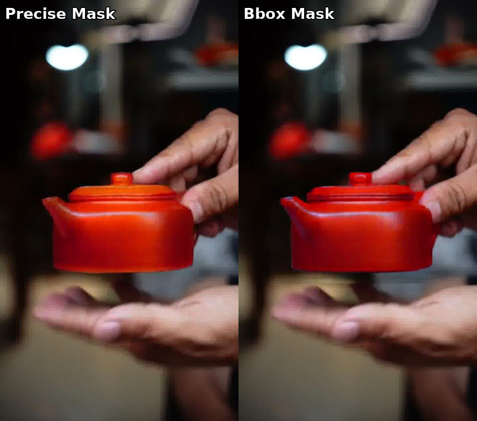
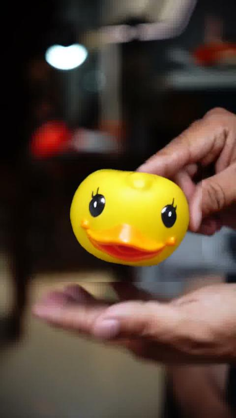

# PVTT (Product Video Template Transfer) 阶段性实验报告：VACE 模型能力边界探究

## 任务定义与核心挑战 (Problem Definition)

PVTT 任务理解：实现 **基于视频模版的电商换品生成**。具体流程如下：
*   **Input**:
    *   `Source Video`: 原始模版视频（例如：展示一个茶壶的动态视频）。
    *   `Mask`: 指定视频中需要替换的物体区域（时空掩码）。
    *   `Ref Image`: 目标商品图片（例如：一个小黄鸭玩具）。
    *   `Prompt`: 辅助文本描述。
*   **Output**: `Target Video`。保持原视频的运镜、光照和背景，但将主体物体无缝替换为目标商品。

核心难点
*   **Identity Retention (ID 保持)**: 生成的物体必须与 Ref Image 高度一致。
*   **Structure & Motion Preservation**: 必须完美继承原视频的运动节奏。
*   **Inpainting Consistency**: 替换后的物体边缘必须与背景自然融合，不能有违和感。

## 实验路径与猜想验证

为了探究当前 SOTA 模型 **Wan2.1-VACE** 在 Zero-Shot（零样本）条件下的表现，我设计并执行了以下实验。

### 2.1 Baseline 实验：VACE-1.3B + 精确 Mask

**实验设置**:
*   模型: Wan2.1-VACE-1.3B
*   输入: 茶壶视频 + SAM2生成的精确茶壶 Mask + 鸭子参考图
*   控制变量: Reactive Flow Weight（流权重）调整

**实验 1.1: 默认权重 (Weight=1.0)**
*   **现象**: 目标替换完全不生效
    
*   **分析**: VACE 模型在默认设置下，对 Source Video 的结构（茶壶形状）保留过强，Ref Image 的语义被忽略。

**实验 1.2: 流权重清零 (Weight=0.0)**
*   **目的**: 强制模型忽略 Mask 区域内的原视频信息，只看 Ref Image。
*   **现象**: 茶壶确实被“擦除”了，试图生成鸭子。但效果极差：
    
    *   形状依然受到茶壶隐性约束（长得像个茶壶形状的鸭子）。
    *   ID 严重丢失（生成的鸭子和 Ref Image 长得不像）。
*   **结论**: 单纯调节流权重无法解决 ID 保持和形状冲突的问题。

### 猜想验证：Mask 形状的强先验干扰？

**Hypothesis (猜想)**: 会不会是因为使用了 **Precise Mask (精确掩码)**，导致模型被“锁死”在茶壶的轮廓里？如果我们给模型一个更宽松的 **Bounding Box Mask**，它是否有足够的空间去生成形状不同的鸭子？

**实验 2.1: Bbox Mask + 默认权重**
*   **输入**: 将精确 Mask 替换为扩大的矩形框 (Bbox)。
*   **结果**: 依然失败。
    

**实验 2.2: Bbox Mask + 流权重清零**
*   **结果**: 与精确 Mask 下清零权重的效果类似，依然生成了“茶壶状的扭曲物体”，且 ID 丢失严重。
    

**❌ 结论 (Falsified)**: **Mask 的形状并不是根本原因**。即使给了宽松的空间，VACE-1.3B 依然无法有效利用 Ref Image 进行正确的物体生成。

### 猜想验证：模型规模瓶颈？(Scaling Law)

**Hypothesis (猜想)**: 是不是 1.3B 模型参数量太小，导致语义理解能力和指令遵循能力不足？如果换用更强的 **Wan2.1-VACE-14B**，能否解决问题？

**实验 3: 14B 模型全量复现**
*   **操作**: 在 HKUST SuperPod GPU 集群上，加载 14B 模型重跑上述 4 组实验。
*   **结果**: 依然无法实现PVTT的项目要求

**❌ 结论 (Falsified)**: **单纯提升模型规模无法解决结构性的缺陷**。

## 原因分析

通过上述一系列消融实验，可以得出结论：**VACE 目前的架构不适合直接做 Zero-Shot 的物体替换。**

1.  **条件注入方式太弱**:
    VACE 将 Ref Image 拼接在 VCU 中作为 Context 输入。这种方式对于“风格参考”有效，但对于“强 ID 植入”太弱了。模型“看到了”鸭子，但不知道“要把鸭子画进去”。

2.  **缺乏 ID 专用模块**:
    类似于 Stable Diffusion 中的经验，如果不开 IP-Adapter 或 ReferenceNet，仅靠 Inpainting 是很难换脸/换品的。VACE 缺少一个专门的 **Image Prompt Adapter**。
