# Wan2.1-VACE 商品视频替换实验报告

> **项目**: PVTT (Product Video Try-on / 商品视频替换)
> **日期**: 2026-03-03 ~ 2026-03-09
> **模型**: Wan2.1-VACE (1.3B & 14B)
> **测试样本**: teapot (茶壶) → rubber duck (黄色橡皮鸭)
> **统一参数**: 分辨率 480×848, 49 帧, seed=42, prompt="yellow rubber duck toy, product display, studio lighting"

---

## 目录

- [Wan2.1-VACE 商品视频替换实验报告](#wan21-vace-商品视频替换实验报告)
  - [目录](#目录)
  - [1. 实验背景与目标](#1-实验背景与目标)
  - [2. 实验设计概览](#2-实验设计概览)
    - [实验变量](#实验变量)
    - [10 组实验](#10-组实验)
  - [3. 1.3B 模型实验结果](#3-13b-模型实验结果)
    - [3.1 实验一：Source Video + Precise Mask + Ref Image](#31-实验一source-video--precise-mask--ref-image)
    - [3.2 实验二：Source Video + Precise Mask + Ref Image + 流权重调整](#32-实验二source-video--precise-mask--ref-image--流权重调整)
    - [3.3 实验三：Source Video + Bbox Mask + Ref Image](#33-实验三source-video--bbox-mask--ref-image)
    - [3.4 实验四：Source Video + Bbox Mask + Ref Image + 流权重调整](#34-实验四source-video--bbox-mask--ref-image--流权重调整)
    - [3.5 实验五：Mask Video (中性色填充) + Precise Mask + Ref Image](#35-实验五mask-video-中性色填充--precise-mask--ref-image)
    - [3.6 实验六：Mask Video (中性色填充) + Bbox Mask + Ref Image](#36-实验六mask-video-中性色填充--bbox-mask--ref-image)
    - [3.7 实验七：Mask Video (中性色填充) + GrowMask + BlockifyMask](#37-实验七mask-video-中性色填充--growmask--blockifymask)
    - [3.8 实验八：ComfyUI 工作流 1:1 复刻](#38-实验八comfyui-工作流-11-复刻)
    - [3.9 实验九：双参考图（商品图 + Canny 结构图）](#39-实验九双参考图商品图--canny-结构图)
    - [3.10 实验十：Canny 首帧粘贴（白线/黑线对比）](#310-实验十canny-首帧粘贴白线黑线对比)
  - [4. 14B 模型实验结果](#4-14b-模型实验结果)
    - [4.1 实验一：Source Video + Precise Mask + Ref Image](#41-实验一source-video--precise-mask--ref-image)
    - [4.2 实验二：Source Video + Precise Mask + Ref Image + 流权重调整](#42-实验二source-video--precise-mask--ref-image--流权重调整)
    - [4.3 实验三：Source Video + Bbox Mask + Ref Image](#43-实验三source-video--bbox-mask--ref-image)
    - [4.4 实验四：Source Video + Bbox Mask + Ref Image + 流权重调整](#44-实验四source-video--bbox-mask--ref-image--流权重调整)
    - [4.5 实验五：Mask Video (中性色填充) + Precise Mask + Ref Image](#45-实验五mask-video-中性色填充--precise-mask--ref-image)
    - [4.6 实验六：Mask Video (中性色填充) + Bbox Mask + Ref Image](#46-实验六mask-video-中性色填充--bbox-mask--ref-image)
    - [4.7 实验七：Mask Video (中性色填充) + GrowMask + BlockifyMask](#47-实验七mask-video-中性色填充--growmask--blockifymask)
    - [4.8 实验八：ComfyUI 工作流 1:1 复刻](#48-实验八comfyui-工作流-11-复刻)
  - [5. 实验结果汇总对比](#5-实验结果汇总对比)
    - [结果总览表](#结果总览表)
    - [推理性能对比](#推理性能对比)
  - [6. 结论与分析](#6-结论与分析)
    - [核心发现（实验 1–8）](#核心发现实验-18)
    - [Canny 结构控制实验的发现（实验 9–10）](#canny-结构控制实验的发现实验-910)
    - [对 PVTT 项目的阶段性结论](#对-pvtt-项目的阶段性结论)
    - [后续研究方向](#后续研究方向)

---

## 1. 实验背景与目标

本实验旨在评估 **Wan2.1-VACE** 模型在 **商品视频替换 (PVTT)** 任务上的可行性。具体而言，我们测试将一段包含茶壶的源视频中的茶壶替换为黄色橡皮鸭（参考图像），评估模型在以下方面的表现：

- **目标替换成功率**：能否将参考图像中的商品替换到视频中
- **形状保真度**：替换后的商品是否保持参考图像中的正确形状
- **主体一致性**：替换后的商品在时间序列上是否保持一致的外观

我们分别在 **1.3B** 和 **14B** 两个模型规模上，采用 **多种不同的输入策略** 进行了系统性测试。

---

## 2. 实验设计概览

### 实验变量

| 维度 | 变体 |
|------|------|
| **输入视频** | 原始 Source Video / 中性色填充 Mask Video (fill_value=128) |
| **Mask 类型** | Precise Mask（精确分割掩码）/ Bbox Mask（边界框掩码，padding: lr=20, top=20, bottom=20）/ GrowMask+BlockifyMask（膨胀10px + 网格化32px） |
| **流权重** | 默认权重 / 流权重清零 (reactive_weight=0.0) |
| **模型规模** | 1.3B / 14B |

### 10 组实验

| 编号 | 输入视频 | Mask 类型 | 额外输入 | 流权重 |
|------|----------|-----------|----------|--------|
| 实验1 | Source Video | Precise Mask | — | 默认 |
| 实验2 | Source Video | Precise Mask | — | 0.0 (清零) |
| 实验3 | Source Video | Bbox Mask | — | 默认 |
| 实验4 | Source Video | Bbox Mask | — | 0.0 (清零) |
| 实验5 | Mask Video (中性色填充) | Precise Mask | — | 默认 |
| 实验6 | Mask Video (中性色填充) | Bbox Mask | — | 默认 |
| 实验7 | Mask Video (中性色填充) | GrowMask+BlockifyMask | — | 默认 |
| 实验8 | Mask Video (中性色填充) + 去背景参考图 + LightX2V LoRA | GrowMask+BlockifyMask | — | 默认 |
| 实验9 | Mask Video (中性色填充) | GrowMask+BlockifyMask | Ref Image + Ref Canny 双参考图 | 默认 |
| 实验10 | Mask Video (中性色填充, 首帧嵌入 Canny) | GrowMask+BlockifyMask | Ref Image + 首帧结构控制 | 默认 |

> **实验8** 为 1:1 复刻 ComfyUI VACE 工作流的对照实验，额外引入：参考图去背景（BiRefNet）、LightX2V 蒸馏 LoRA（rank32, strength=1.0）、单步采样（steps=1）、CFG=6.0 + CFG_Star=5.0。
>
> **实验9–10** 为 Canny 结构控制实验（仅在 1.3B 模型上完成），探索通过引入结构控制图来提升主体一致性。

---

## 3. 1.3B 模型实验结果

### 3.1 实验一：Source Video + Precise Mask + Ref Image

**实验配置**：
- 输入：原始源视频 + 精确分割掩码 + 参考图像 + 文本提示
- 推理时间：~1min 19s

**结果**：完全没有实现目标替换。模型几乎忽略了参考图像，输出视频中茶壶保持原样。

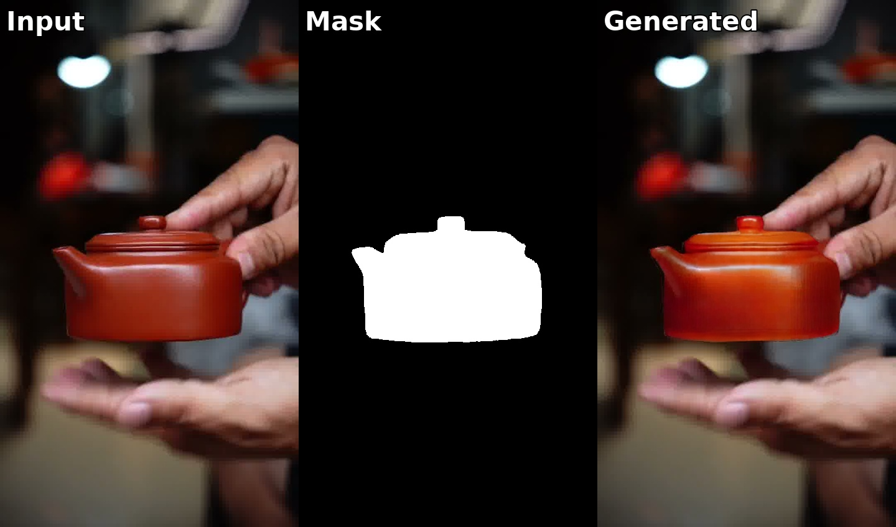
*图：左侧为输入帧/mask，右侧为输出帧。可以看到茶壶完全没有被替换。*

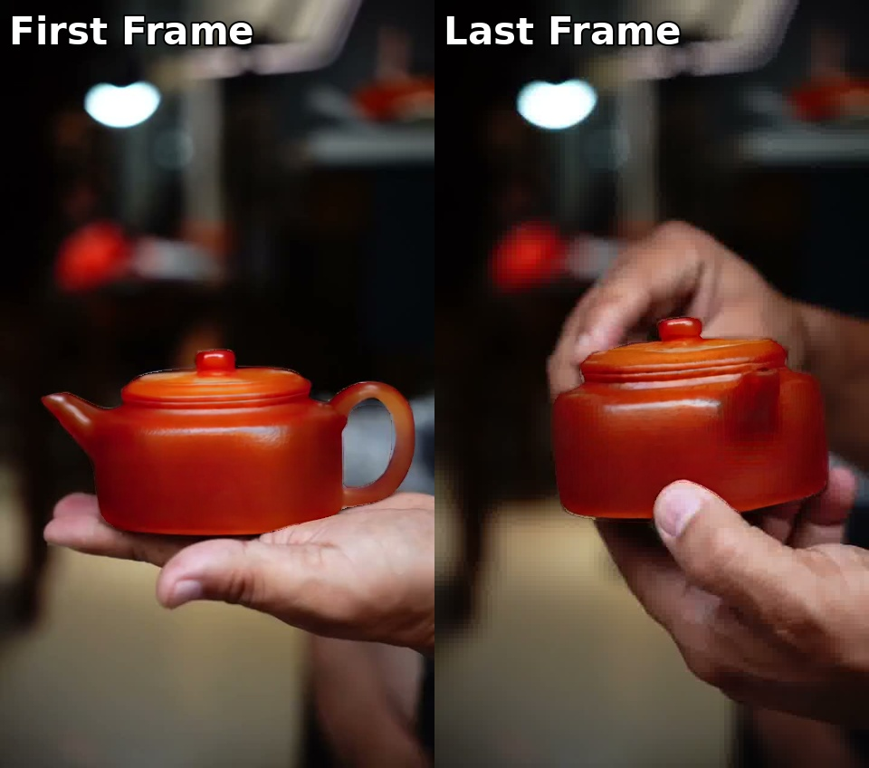
*图：首帧与末帧展示，茶壶始终保持原样。*

**分析**：当输入为原始 source video 时，模型倾向于保持（"修复"）原有内容，精确掩码反而让模型精确地还原了被遮罩的区域，而非替换为参考图像。

---

### 3.2 实验二：Source Video + Precise Mask + Ref Image + 流权重调整

**实验配置**：
- 输入：原始源视频 + 精确分割掩码 + 参考图像 + 文本提示
- 流权重：reactive_weight = 0.0（完全清零）
- 推理时间：~1min 19s

**结果**：流权重清零后才能把参考图像替换上去，但形状怪异，与原茶壶形状类似，且主体一致性极差。

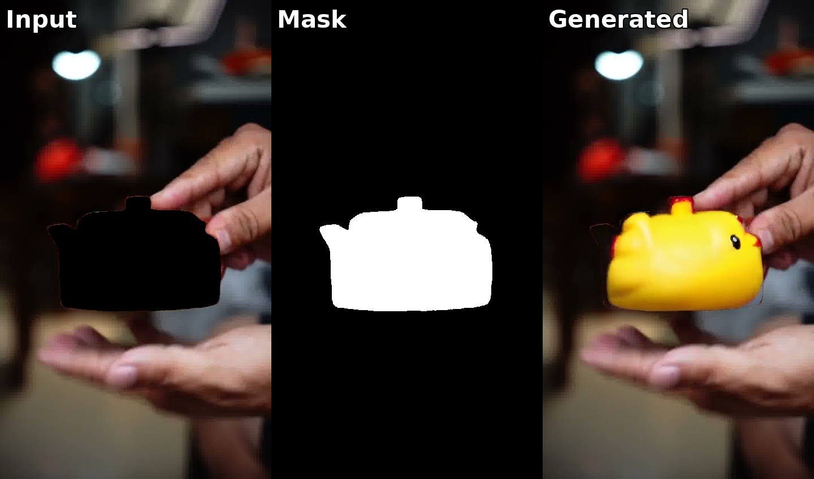
*图：流权重清零后的对比结果。虽然能看到替换的痕迹，但生成的物体形状仍受原茶壶轮廓的强烈影响。*

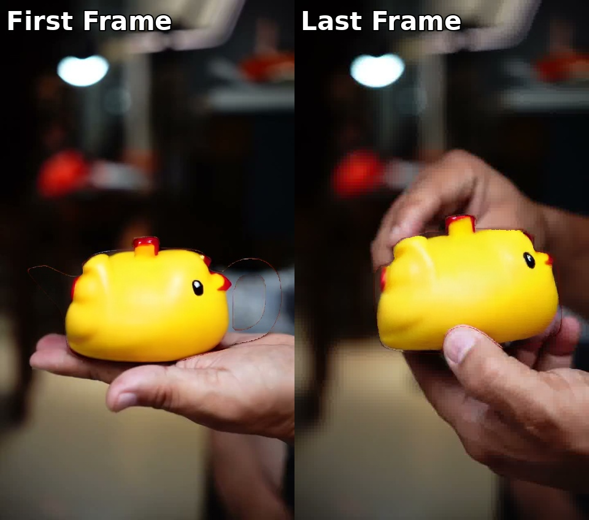
*图：首末帧展示。替换后物体的形状与橡皮鸭差异明显，更像是原茶壶形状的变形。*

**分析**：将 reactive flow weight 清零后，模型不再被源视频的运动信息约束，开始尝试在 mask 区域生成新内容。但由于 source video 的像素仍作为条件输入，模型生成的形状仍受原物体轮廓的强烈影响，无法产生与参考图像一致的形状。

---

### 3.3 实验三：Source Video + Bbox Mask + Ref Image

**实验配置**：
- 输入：原始源视频 + 边界框掩码（padding: lr=20, top=20, bottom=20）+ 参考图像 + 文本提示
- 推理时间：~1min 19s

**结果**：完全没有实现目标替换。

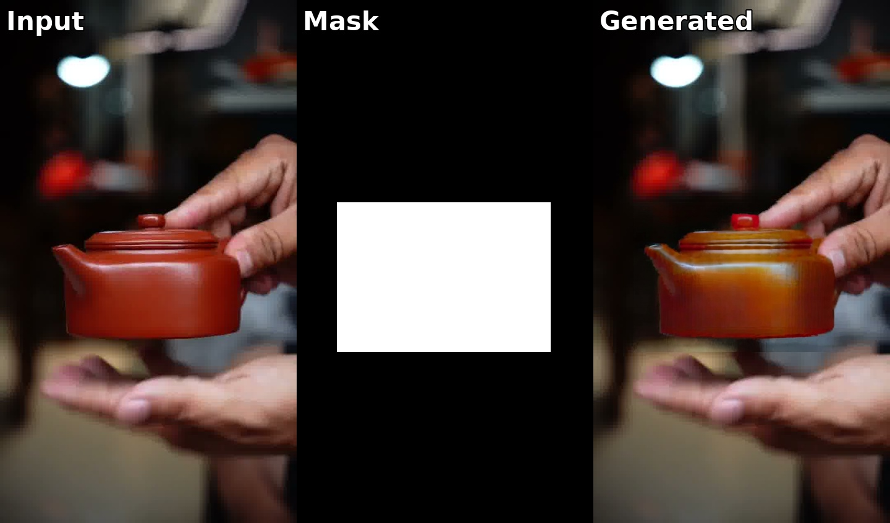
*图：Bbox Mask 实验组对比。即使使用了更宽松的边界框掩码，茶壶仍未被替换。*

*图：Precise Mask 与 Bbox Mask 的区别。Bbox Mask 是精确掩码的外接矩形加上 padding。*

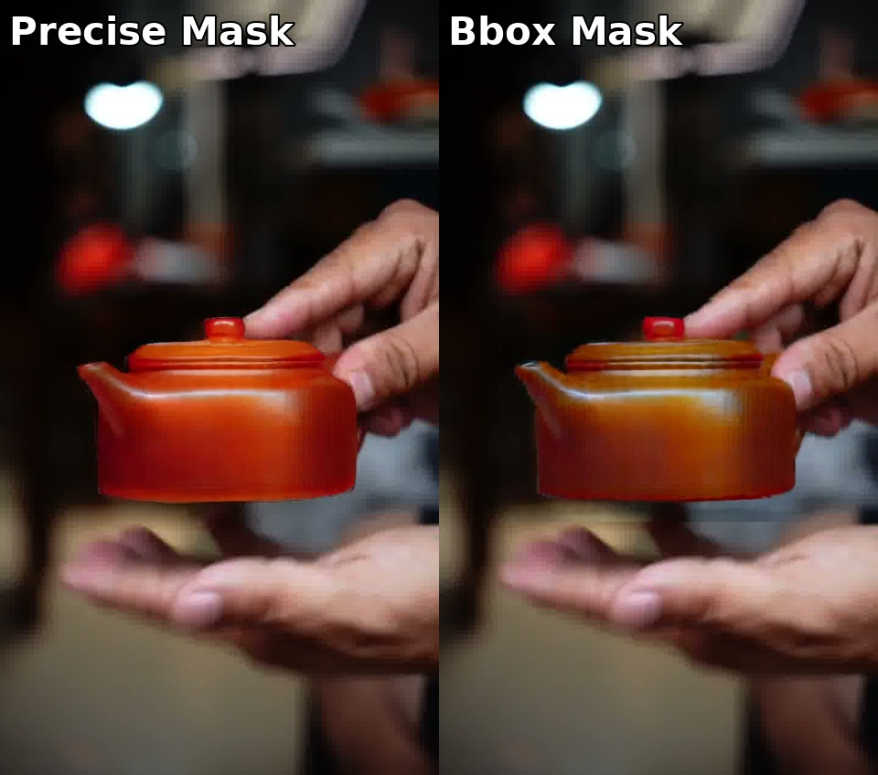
*图：Bbox Mask 与 Precise Mask 两组实验的第 24 帧并排对比，两者均未实现替换。*

**分析**：更宽松的 Bbox Mask 没有带来改善。当 source video 作为输入时，无论 mask 形状如何，模型都倾向于还原原始内容。

---

### 3.4 实验四：Source Video + Bbox Mask + Ref Image + 流权重调整

**实验配置**：
- 输入：原始源视频 + 边界框掩码 + 参考图像 + 文本提示
- 流权重：reactive_weight = 0.0（完全清零）
- 推理时间：~1min 19s

**结果**：流权重清零后才能把参考图像替换上去，但形状怪异，与原茶壶形状类似，且主体一致性极差。

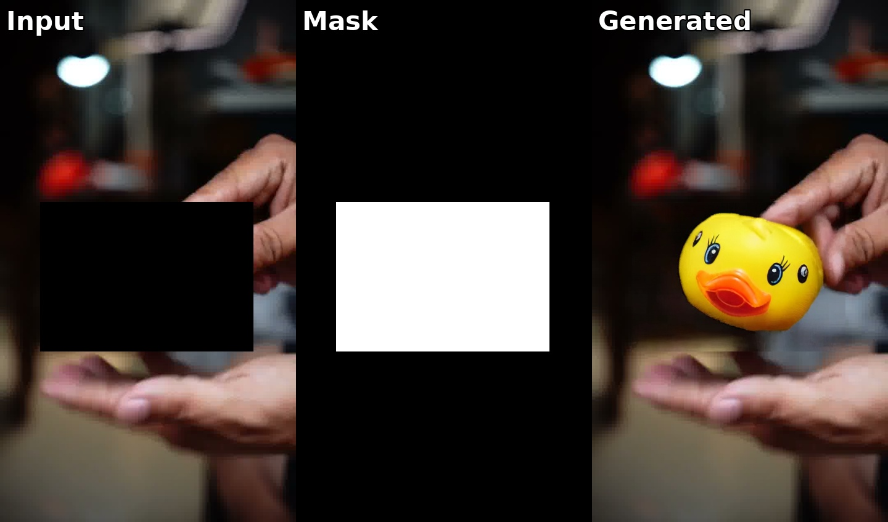
*图：Bbox Mask + 流权重清零的对比结果。*

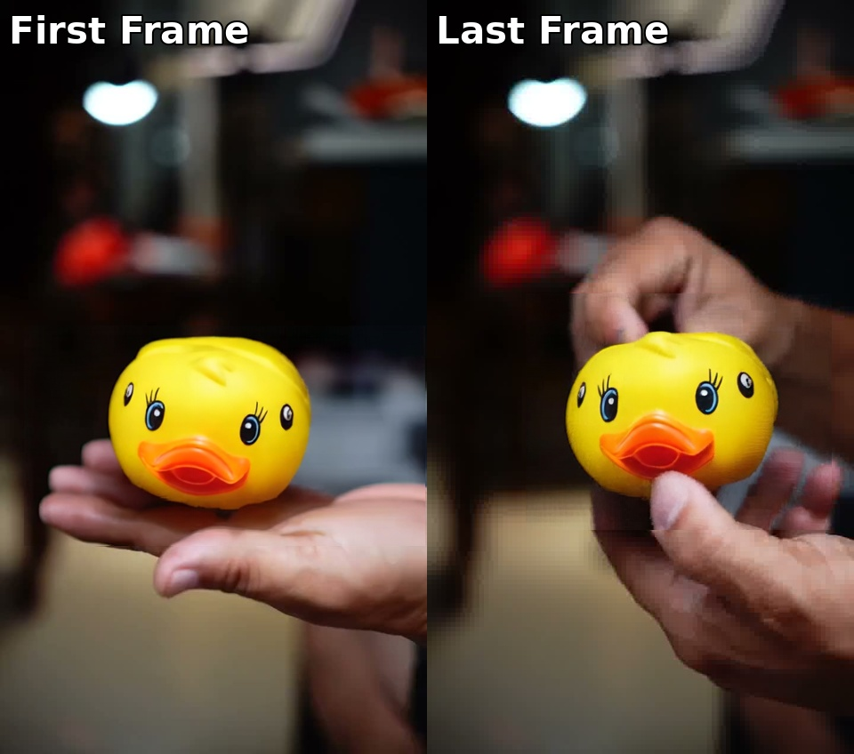
*图：首末帧展示。即使使用了 Bbox Mask 提供更大的替换区域，生成物体的形状仍然怪异。*

*图：生成的 Bbox Mask 示例（第 0 帧）。*

**分析**：与实验二类似，Bbox Mask 配合流权重清零可以启动替换，但替换质量同样很差。更大的 mask 区域并未显著改善形状保真度。

---

### 3.5 实验五：Mask Video (中性色填充) + Precise Mask + Ref Image

**实验配置**：
- 输入：中性色填充视频（mask 区域用 fill_value=128 灰色填充）+ 精确掩码 + 参考图像 + 文本提示
- 推理时间：~1min 19s

**结果**：能把参考图像替换上去，但形状怪异，与原茶壶形状类似，且主体一致性极差。

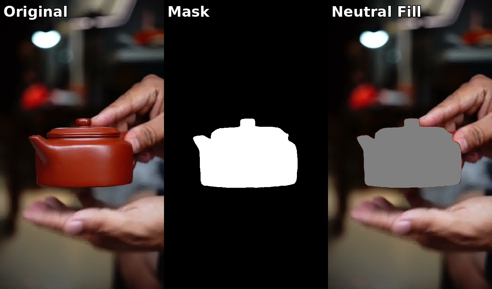
*图：预处理对比。左为原始帧，右为中性色填充后的帧，mask 区域被灰色覆盖，消除了原物体的视觉信息。*

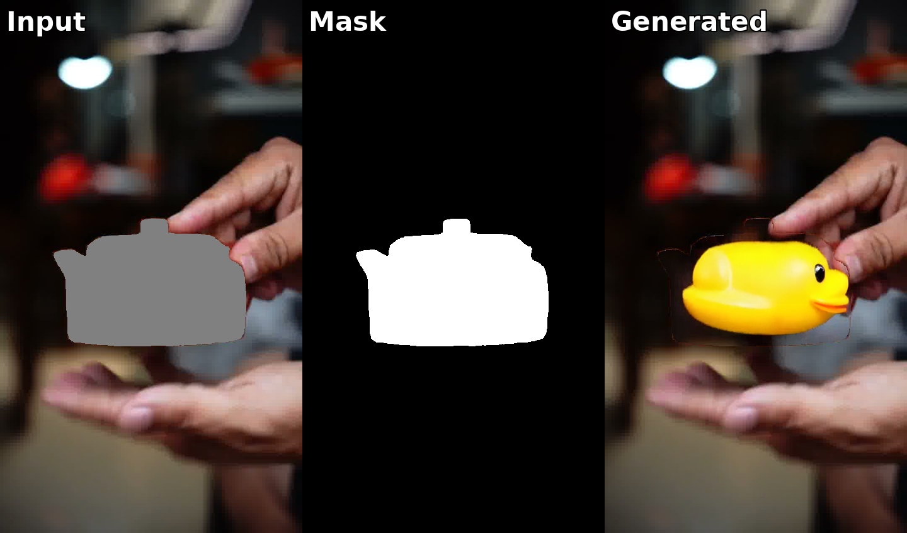
*图：生成结果对比。虽然能看到鸭子的替换尝试，但形状明显不正确。*

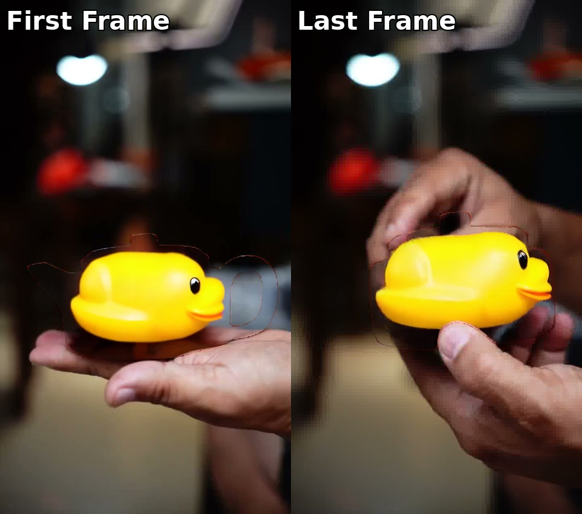
*图：首末帧展示。替换后的物体形状失真严重。*

**分析**：用中性色填充消除了原物体的像素信息，模型不再倾向于还原原始内容，转而尝试根据参考图像生成新内容。然而，由于精确掩码紧贴原物体轮廓，模型仍然受到 mask 形状的约束，导致生成的鸭子形状向茶壶轮廓靠拢。

---

### 3.6 实验六：Mask Video (中性色填充) + Bbox Mask + Ref Image

**实验配置**：
- 输入：中性色填充视频 + 边界框掩码 + 参考图像 + 文本提示
- Bbox 边距：lr=20, top=20, bottom=20
- 推理时间：~1min 18s

**结果**：能把参考图像替换上去，但形状怪异，与原茶壶形状类似，且主体一致性极差。

*图：预处理对比。Bbox 区域用中性色填充，提供了比精确 mask 更大的"空白画布"。*

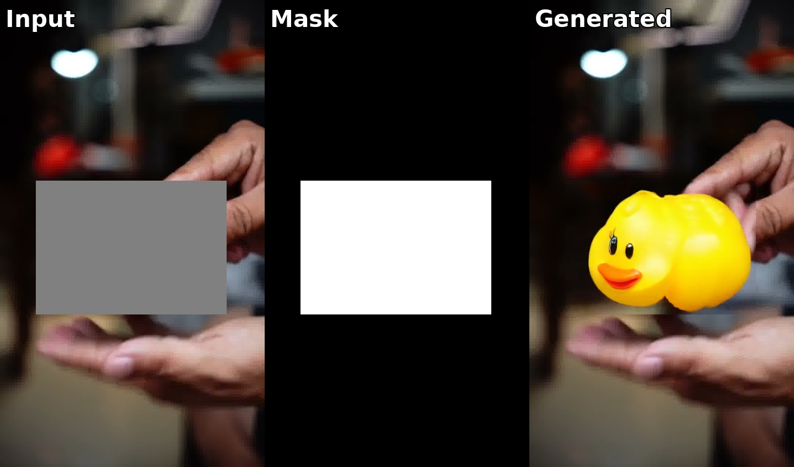
*图：生成结果对比。虽然 Bbox Mask 提供了更大的生成区域，但形状问题依然存在。*

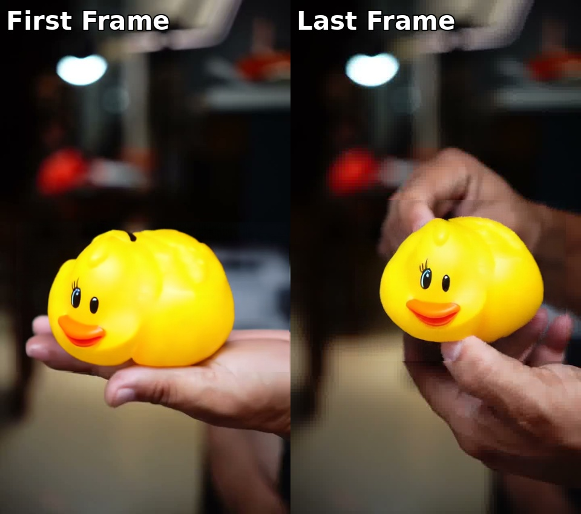
*图：首末帧展示。物体形状仍然不像标准的橡皮鸭。*

**分析**：Bbox Mask 虽然提供了更大的区域，但生成质量未显著改善。模型在 1.3B 规模下，对参考图像的理解和还原能力有限。

---

### 3.7 实验七：Mask Video (中性色填充) + GrowMask + BlockifyMask

**实验配置**：
- 输入：中性色填充视频 + GrowMask(膨胀10px) + BlockifyMask(网格化32px) + 参考图像 + 文本提示
- 该 mask 处理方式与 ComfyUI 工作流的 mask 处理一致
- 推理时间：~1min 19s

**结果**：能把参考图像替换上去，但形状怪异，与原茶壶形状类似，且主体一致性极差。

*图：Mask 预处理对比。左为原始精确 mask，右为 GrowMask(10px) + BlockifyMask(32px) 处理后的 mask。可以看到 mask 被膨胀并网格化。*

*图：预处理对比。处理后的 mask 覆盖区域更大且呈块状。*

*图：生成结果对比。与 ComfyUI 工作流一致的 mask 处理方式依然无法产生良好的替换效果。*

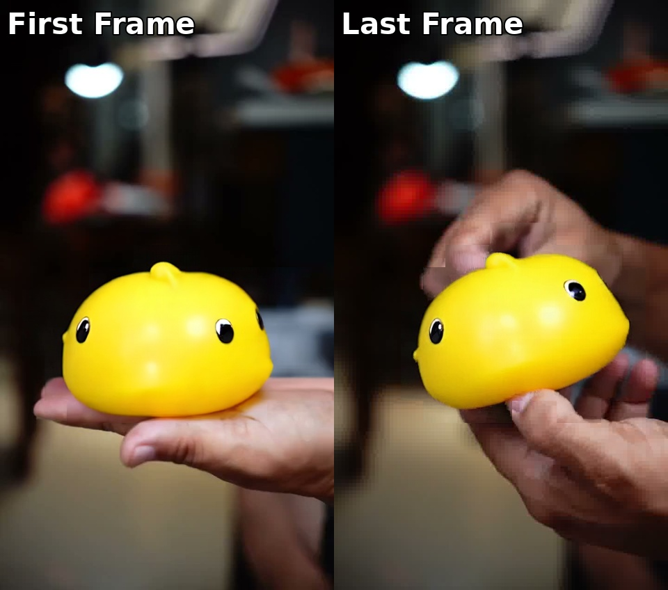
*图：首末帧展示。替换后的形状仍不符合预期。*

**分析**：GrowMask + BlockifyMask 的处理虽然进一步扩大了 mask 区域并消除了精确轮廓的约束，但在 1.3B 模型上仍未产生满意的替换效果。这表明问题不仅在于 mask 形状的约束，1.3B 模型自身的能力也是限制因素。

---

### 3.8 实验八：ComfyUI 工作流 1:1 复刻

**实验配置**：
- 1:1 复刻 ComfyUI VACE 商品替换工作流（精度保持 bf16 而非 fp8）
- 参考图去背景：rembg + birefnet-general（对应 ComfyUI BiRefNetUltra 节点）
- 输入帧：中性色填充（fill_value=128）
- Mask：GrowMask(10px) + BlockifyMask(32px)
- LightX2V 蒸馏 LoRA：rank32, strength=1.0
- 采样参数：CFG=6.0, CFG_Star=5.0, steps=1（ComfyUI 原始参数）
- **注意**：LoRA 为 14B T2V 专用，与 1.3B 模型不兼容，LoRA 合并失败（0/405 层），自动回退至 steps=50
- 实际运行参数：steps=50, LoRA=NO, CFG=6.0, CFG_Star=5.0
- 推理时间：~1min 21s

**结果**：能把参考图像替换上去，但形状怪异，与原茶壶形状类似，且主体一致性保持非常差。

*图：参考图去背景处理对比。左为原始参考图，右为 BiRefNet 去背景后的结果。*

*图：Mask 预处理对比。原始精确 mask → GrowMask(10px) + BlockifyMask(32px) 处理后的 mask。*

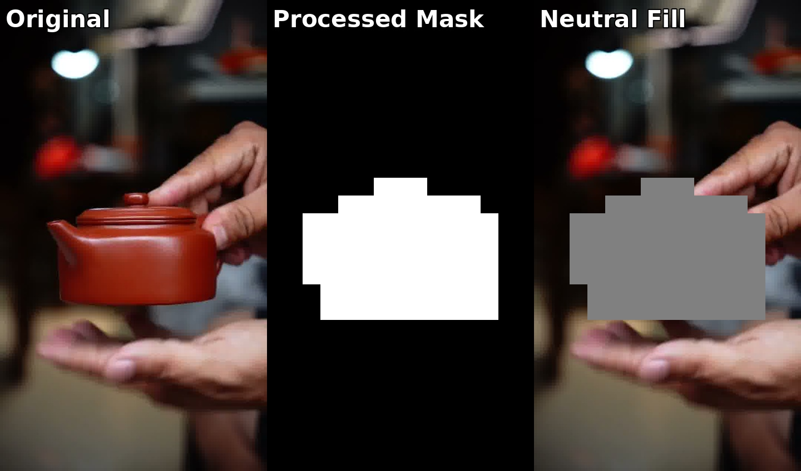
*图：输入帧预处理对比。原始帧 vs 中性色填充后的帧。*

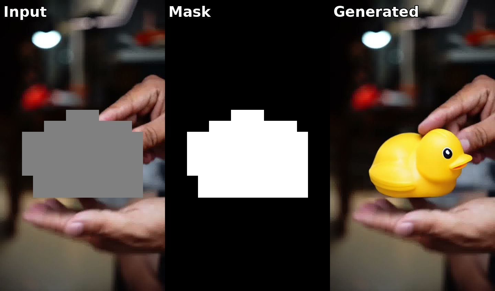
*图：生成结果对比。由于 LoRA 加载失败（14B LoRA 与 1.3B 模型不兼容），实际退化为实验七的 CFG 变体（CFG=6.0, CFG_Star=5.0 vs 实验七 CFG=7.5）。*

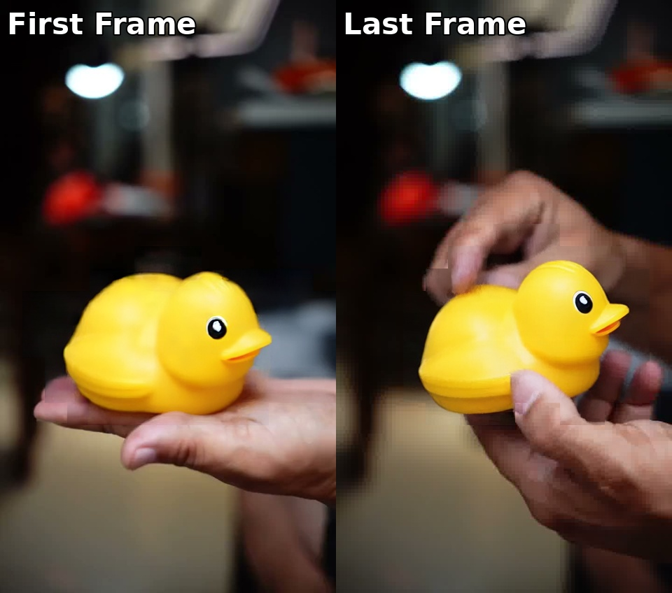
*图：首末帧展示。替换后物体形状失真严重，主体一致性极差。*

**分析**：由于 LightX2V 蒸馏 LoRA 是为 14B T2V 模型训练的，与 1.3B 模型参数不匹配，导致 LoRA 合并完全失败。脚本自动将采样步数从 1 调整至 50，实际运行效果退化为一个参数略有调整的实验七变体。结果与实验七基本一致，进一步确认 1.3B 模型在该任务上的能力瓶颈。

---

### 3.9 实验九：双参考图（商品图 + Canny 结构图）

**实验动机**：

前 8 组实验中，即使实现了目标替换，生成物体的**外形轮廓和内部细节都非常糟糕**，无法满足 PVTT 项目对主体一致性的要求。由此产生一个想法：**能否通过引入结构控制图（如 Canny 边缘）对生成结果进行强约束，提升主体一致性？**

最直接的注入方式是将 Canny 结构图与商品参考图一起作为参考图传给 VACE，让模型同时获得外观信息和结构信息。

**实验配置**：
- 输入视频：Mask Video（中性色填充，fill_value=128）— 与实验七相同，不在帧内嵌入任何 Canny
- Mask 处理：GrowMask(10px) + BlockifyMask(32px)
- 参考图：**两张** — 商品外观图 + 该商品的 Canny 边缘图（双参考图传入 VACE）
- Canny 预处理：rembg 前景分割去除背景+阴影 → Canny(low=50, high=150) + GaussianBlur(k=3)
- 推理参数：steps=50, CFG=7.5, seed=42

**结果**：主体一致性只有轻微提升，整体效果仍然很差。外形轮廓依旧不正确，无法满足 PVTT 项目要求。

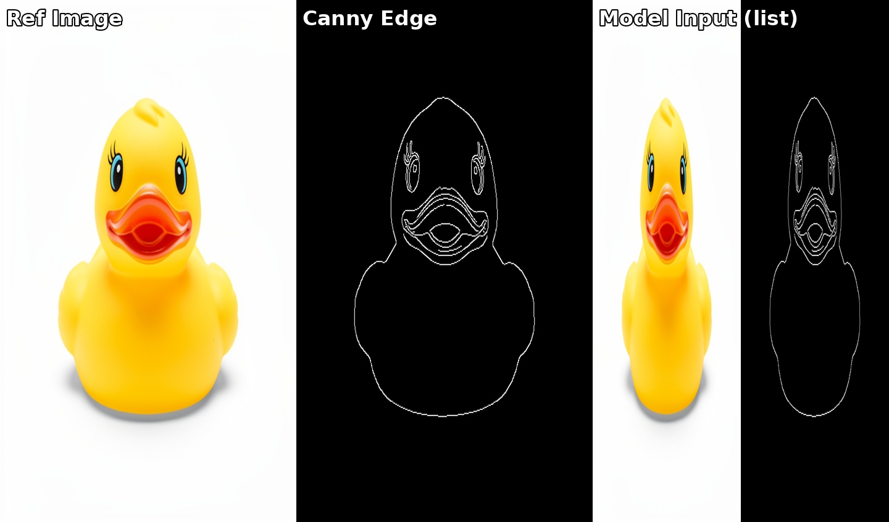
*图：参考图对比。左 = 商品参考图，中 = Canny 边缘图，右 = 实际传入模型的参考图（双参考图列表）。*

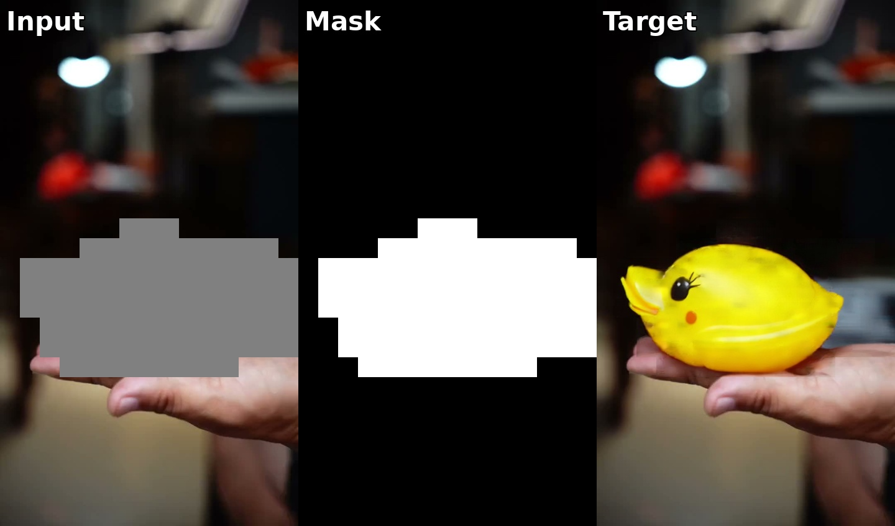
*图：[VACE 输入帧 | Mask | 生成结果] 第一帧对比。可以看到虽然有替换尝试，但主体一致性仅轻微改善。*

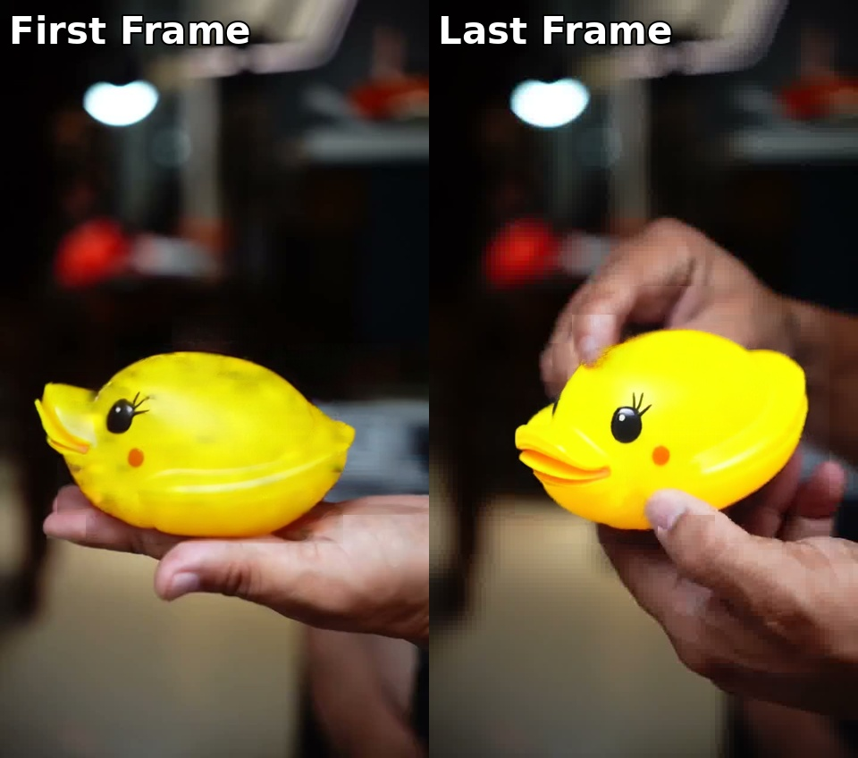
*图：首帧与末帧展示。外形轮廓依旧不正确，未能还原参考图的鸭子形状。*

**分析**：将 Canny 结构图作为第二张参考图传入 VACE，模型对结构信息的利用非常有限。这可能是因为 VACE 的 `vace_reference_image` 参数本身是为提供外观/纹理信息设计的，直接传入黑白边缘图作为参考，模型难以有效理解其中的结构语义。**单纯"附加参考图"的注入方式不足以实现结构约束。**

---

### 3.10 实验十：Canny 首帧粘贴（白线/黑线对比）

**实验动机**：

受 training-free 方法的启发：先用图像编辑模型对视频首帧进行目标替换得到高质量首帧，再通过 diffusion 反演 + VACE 生成后续帧，效果不错。这说明**视频首帧对后续帧的生成影响非常大** — 如果首帧的替换足够好，模型会在后续帧中努力维持首帧的效果。

基于此启发：如果在首帧的 mask 区域内直接嵌入目标物体的 Canny 结构信息（而非通过参考图间接传递），模型能否从这个强结构提示出发，生成与结构一致的目标物体并传播到整个视频？

同时，不确定 Canny 线条的对比度（白线 vs 黑线在灰色背景上）对生成效果有无影响，因此取两个极端值进行对比。

**实验配置**：
- 输入视频：Mask Video（中性色填充，fill_value=128），**仅首帧**的 mask 区域嵌入 Canny 边缘线条，其余帧为纯中性色填充
- Mask 处理：GrowMask(10px) + BlockifyMask(32px)
- 参考图：商品外观图（单张）
- Canny 预处理：rembg 前景分割 → Canny(low=50, high=150) + GaussianBlur(k=3)
- 两个变体（同一次运行中依次执行）：
  - **白色线条**：首帧 mask 区域 = 灰色背景(128) + 白色 Canny 边缘(255)
  - **黑色线条**：首帧 mask 区域 = 灰色背景(128) + 黑色 Canny 边缘(0)
- 推理参数：steps=50, CFG=7.5, seed=42

**结果**：**主体一致性得到质变级的提升。** 无论白色还是黑色线条，生成的鸭子在外形轮廓和内部细节上都基本还原了参考图像。虽然局部细节仍有提升空间，但效果远超前 9 组实验。

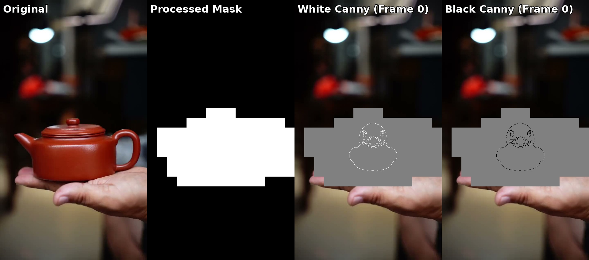
*图：输入帧预处理对比。*

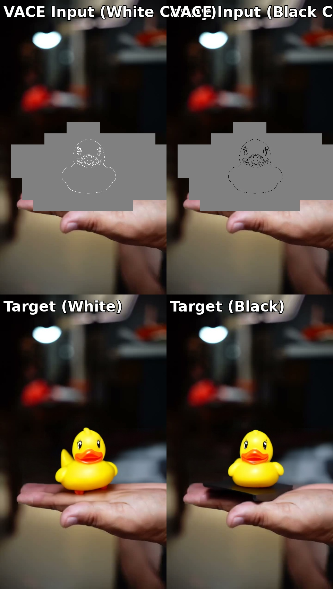
*图：核心对比图。上排 = VACE 实际输入的首帧（左白线、右黑线），下排 = 对应的生成目标首帧。两种线条颜色均产生了远优于前 9 组实验的主体还原效果。*

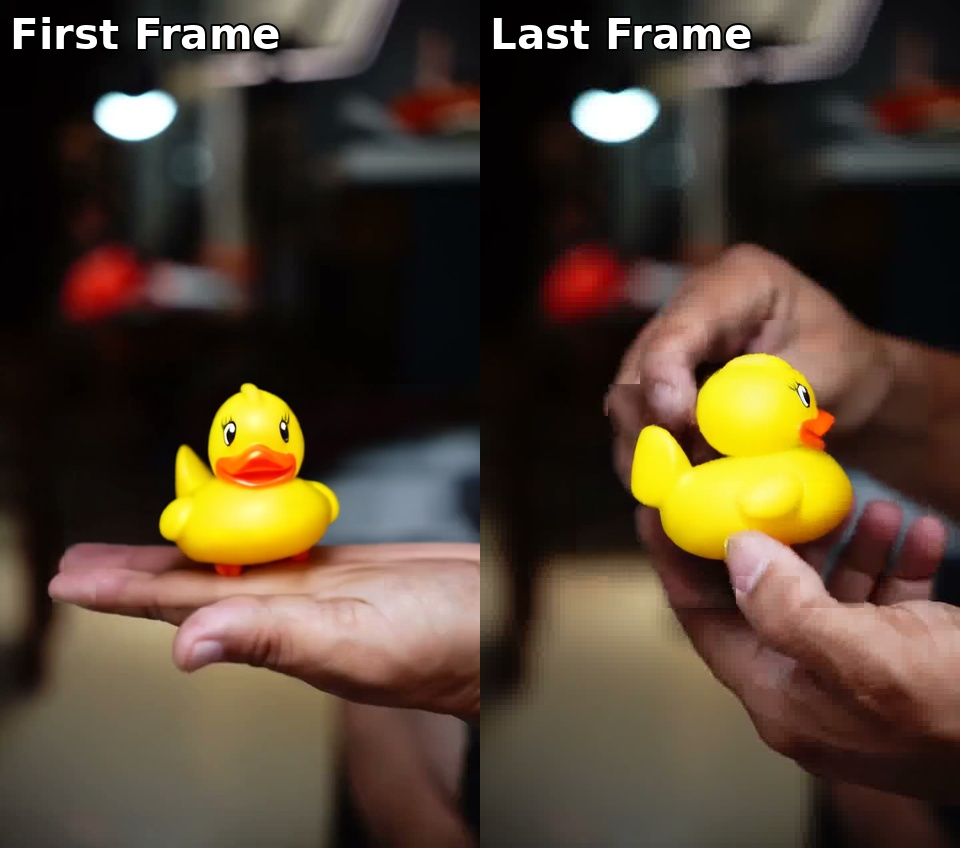
*图：白色线条变体的首帧与末帧展示。鸭子的外形轮廓在视频全程保持良好。*

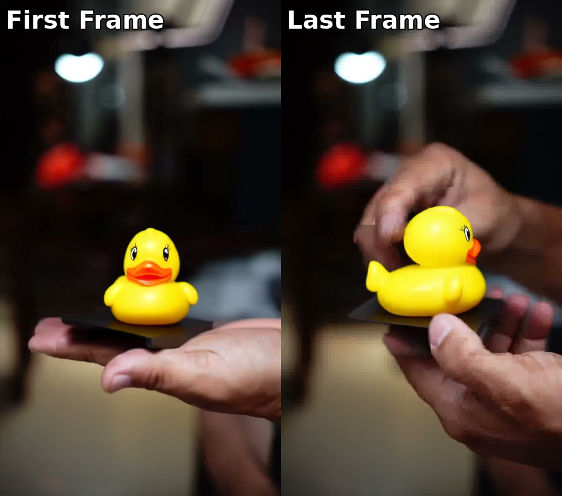
*图：黑色线条变体的首帧与末帧展示。与白色线条效果基本一致。*

**分析**：

1. **首帧结构嵌入 >> 参考图注入**：同样是 Canny 结构信息，实验九（通过参考图传入）效果极差，实验十（嵌入首帧 mask 区域）效果质变。这证实了**视频首帧对后续生成的主导性影响** — VACE 会以首帧为锚点来生成后续帧，首帧的结构信息直接决定了整个视频的生成质量。

2. **线条颜色对生成质量无显著影响**：白色线条和黑色线条在主体还原度上没有明显差异，均能基本还原参考图的外形轮廓和内部细节。

3. **线条颜色的副作用**：白色线条变体中鸭子底部意外长出两只"脚"；黑色线条变体中鸭子底部出现一个黑色"底盘"。推测模型将首帧中线条颜色对比信息当作了局部语义提示，在后续帧生成中引入了不期望的附加结构。

---

## 4. 14B 模型实验结果

### 4.1 实验一：Source Video + Precise Mask + Ref Image

**实验配置**：
- 输入：原始源视频 + 精确分割掩码 + 参考图像 + 文本提示
- 推理时间：~4min 56s

**结果**：完全没有实现目标替换。

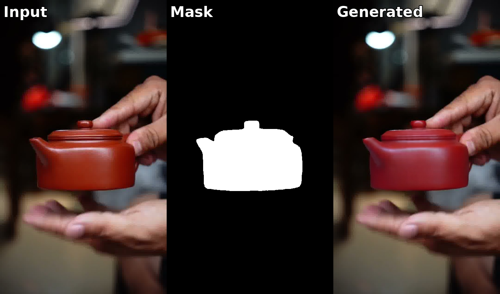
*图：14B 模型精确 mask 对比结果。尽管模型规模更大，茶壶仍然没有被替换。*

*图：首末帧展示。14B 模型同样完全忽略了参考图像。*

**分析**：14B 模型在 source video 输入条件下表现与 1.3B 一致——模型优先还原原始内容。更大的模型可能"修复"能力更强，反而更忠实地还原了原视频。

---

### 4.2 实验二：Source Video + Precise Mask + Ref Image + 流权重调整

**实验配置**：
- 输入：原始源视频 + 精确分割掩码 + 参考图像 + 文本提示
- 流权重：reactive_weight = 0.0（完全清零）
- 推理时间：~4min 56s

**结果**：即使流权重清零，也完全没有实现目标替换。这是与 1.3B 模型的一个关键差异。

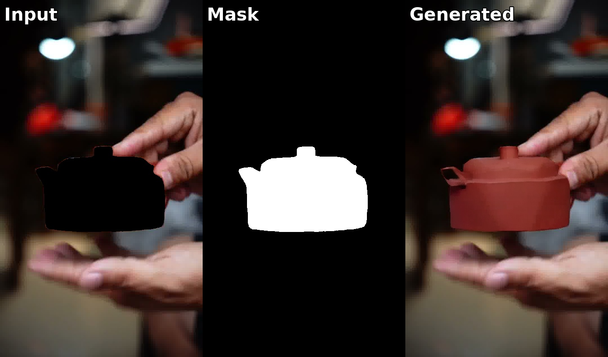
*图：14B 模型流权重清零后的对比结果。与 1.3B 不同，14B 模型即使去掉流约束也无法替换。*

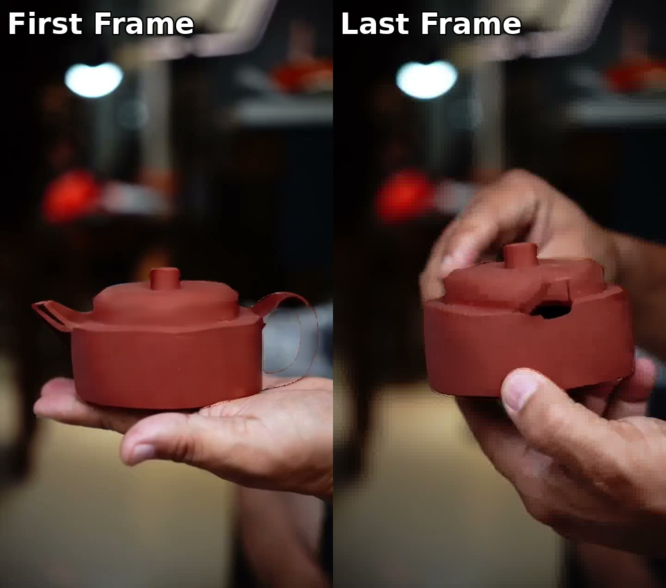
*图：首末帧展示。目标物体未被替换。*

**分析**：14B 模型对源视频的"保真"能力更强，即使去掉 reactive flow weight 的约束，source video 的像素条件仍然主导生成结果，使得模型无法"覆盖"原有内容。这说明 14B 模型比 1.3B 更严格地遵循 source video 条件。

---

### 4.3 实验三：Source Video + Bbox Mask + Ref Image

**实验配置**：
- 输入：原始源视频 + 边界框掩码 + 参考图像 + 文本提示
- 推理时间：~4min 56s

**结果**：完全没有实现目标替换。

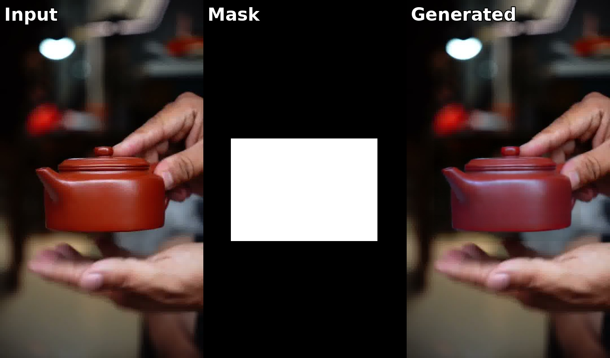
*图：14B Bbox Mask 对比结果。*

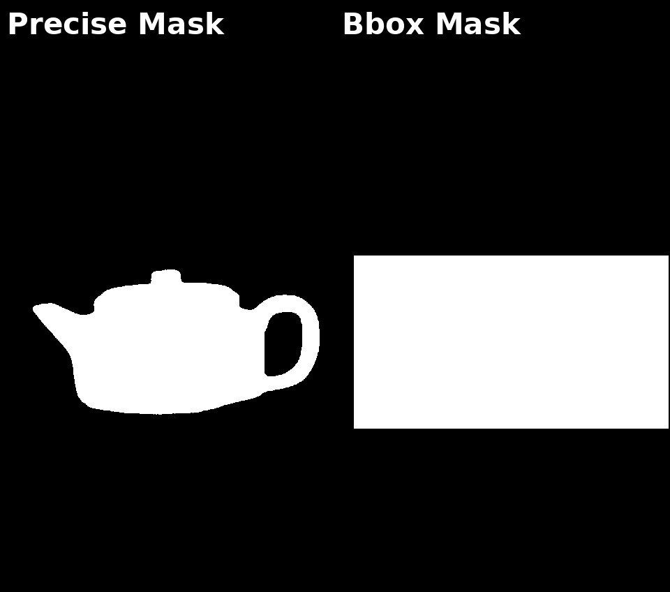
*图：14B 实验中 Precise Mask 与 Bbox Mask 的区别。*

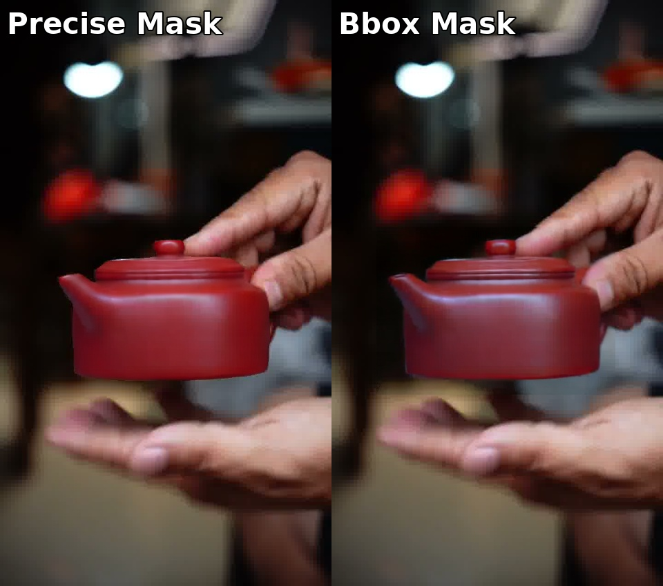
*图：Bbox Mask 与 Precise Mask 的第 24 帧并排对比。两种 mask 都无法实现替换。*

**分析**：结果与 1.3B 一致。Source video 输入下，mask 类型的变化不影响结论。

---

### 4.4 实验四：Source Video + Bbox Mask + Ref Image + 流权重调整

**实验配置**：
- 输入：原始源视频 + 边界框掩码 + 参考图像 + 文本提示
- 流权重：reactive_weight = 0.0（完全清零）
- 推理时间：~4min 56s

**结果**：流权重清零后才能把参考图像替换上去，但形状怪异，与原茶壶形状类似，且主体一致性极差。

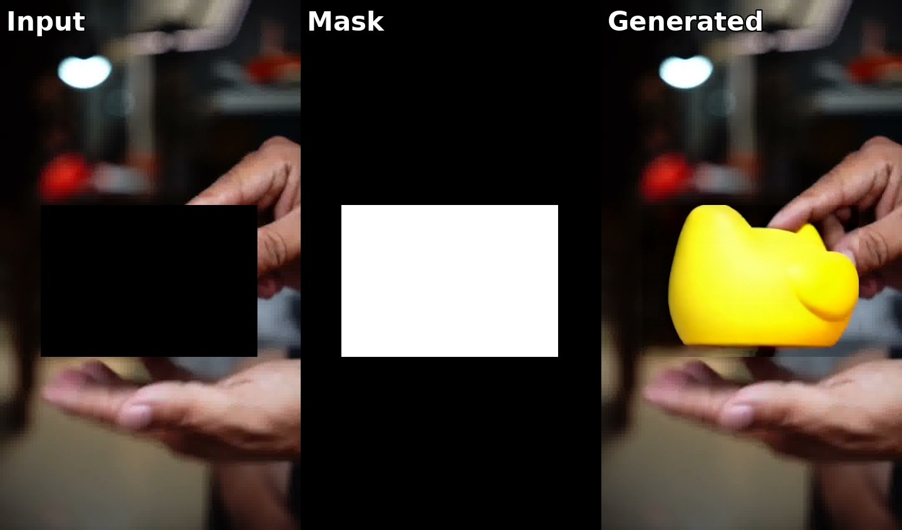
*图：14B Bbox Mask + 流权重清零的对比结果。Bbox Mask 配合流权重清零终于在 14B 上实现了替换，但质量很差。*

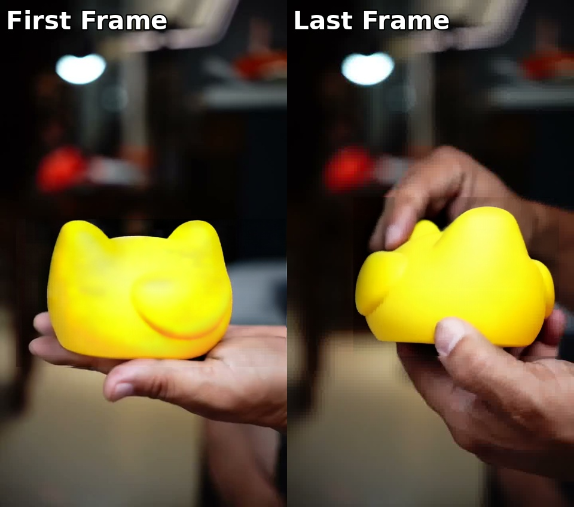
*图：首末帧展示。替换后的物体形状失真严重。*

**分析**：与实验 4.2 对比可以发现一个有趣的现象：14B 模型在 Precise Mask + 流权重清零时无法替换，但在 Bbox Mask + 流权重清零时可以。这说明 Bbox Mask 提供的更大遮罩区域在 14B 模型上比 1.3B 更关键——14B 模型对精确 mask 区域外的未遮罩像素有更强的参考和还原能力。

---

### 4.5 实验五：Mask Video (中性色填充) + Precise Mask + Ref Image

**实验配置**：
- 输入：中性色填充视频（fill_value=128）+ 精确掩码 + 参考图像 + 文本提示
- 推理时间：~4min 56s

**结果**：完全没有实现目标替换。这是与 1.3B 模型的另一个关键差异。

*图：预处理对比。mask 区域已被中性色填充。*

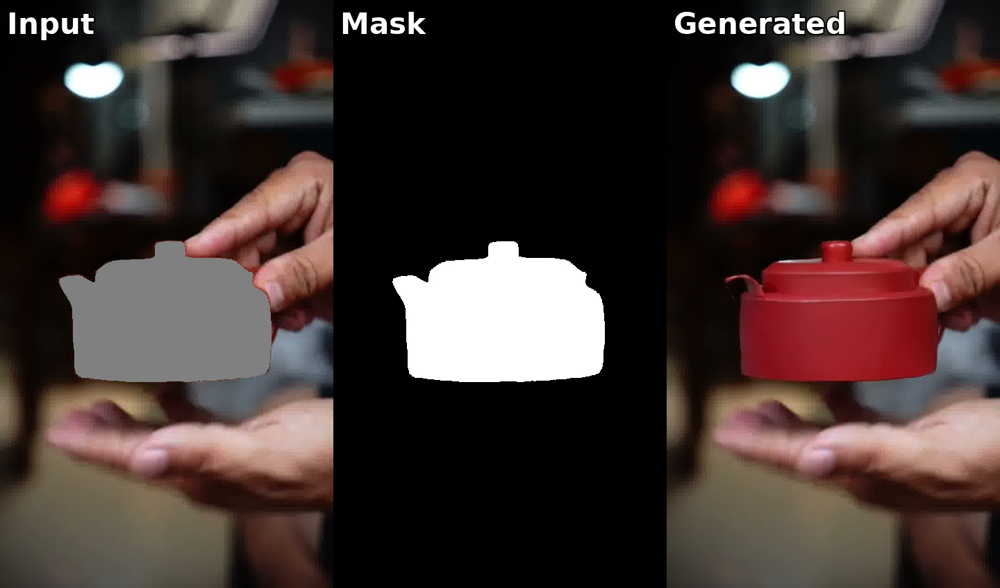
*图：14B 中性色填充 + 精确 mask 的生成结果。即使消除了原物体像素，14B 模型仍未能替换。*

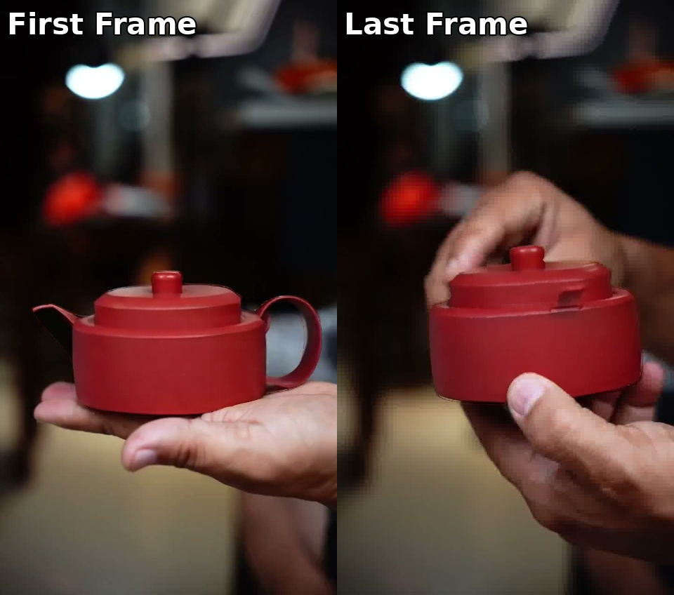
*图：首末帧展示。*

**分析**：这是一个非常值得注意的结果。1.3B 模型在中性色填充 + 精确 mask 下可以实现（尽管质量差的）替换，而 14B 模型却完全失败。推测 14B 模型对精确 mask 的"轮廓感知"更强，即使 mask 内容被灰色替代，模型仍然可能从 mask 的精确边界推断出原物体的轮廓并试图还原。

---

### 4.6 实验六：Mask Video (中性色填充) + Bbox Mask + Ref Image

**实验配置**：
- 输入：中性色填充视频 + 边界框掩码 + 参考图像 + 文本提示
- Bbox 边距：lr=20, top=20, bottom=20
- 推理时间：~4min 56s

**结果**：能把参考图像替换上去，但形状仍是原物品的形状，且主体一致性极差。

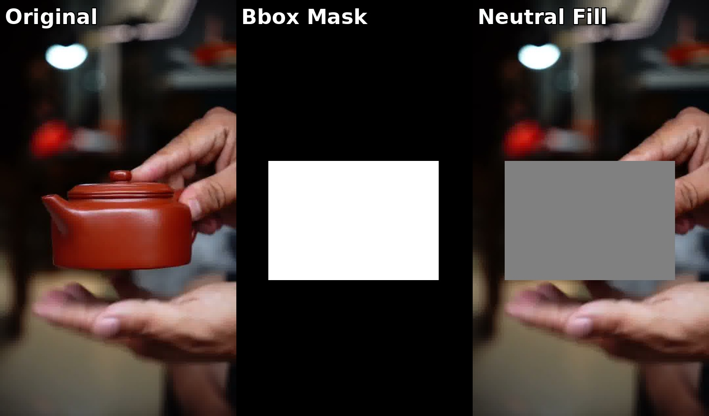
*图：预处理对比。Bbox 区域用中性色填充。*

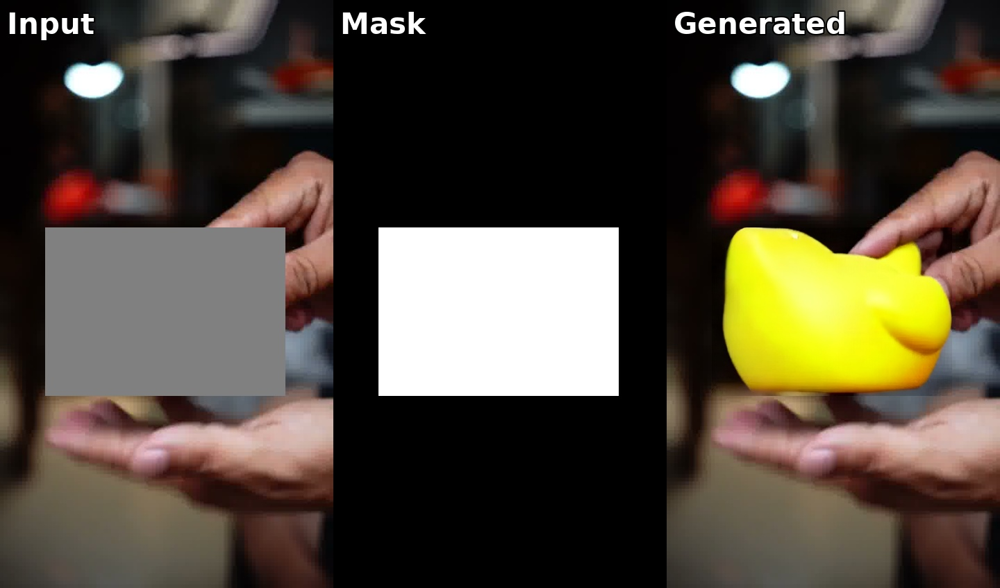
*图：生成结果对比。可以看到替换尝试，但生成物体的形状与原茶壶高度相似。*

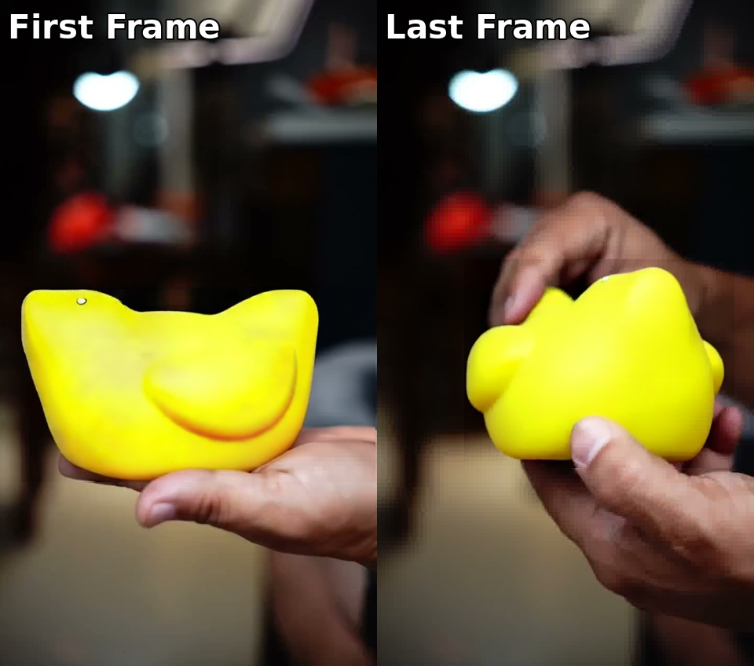
*图：首末帧展示。*

**分析**：Bbox Mask 配合中性色填充在 14B 上终于能够启动替换，但形状问题仍然严重。14B 模型似乎从 mask 以外的上下文（背景、阴影等）中推断原物体形状并将其强加于生成结果。

---

### 4.7 实验七：Mask Video (中性色填充) + GrowMask + BlockifyMask

**实验配置**：
- 输入：中性色填充视频 + GrowMask(膨胀10px) + BlockifyMask(网格化32px) + 参考图像 + 文本提示
- 该 mask 处理方式与 ComfyUI 工作流的 mask 处理一致
- 推理时间：~4min 56s

**结果**：能把参考图像替换上去，但形状怪异，与原茶壶形状类似，且主体一致性极差。

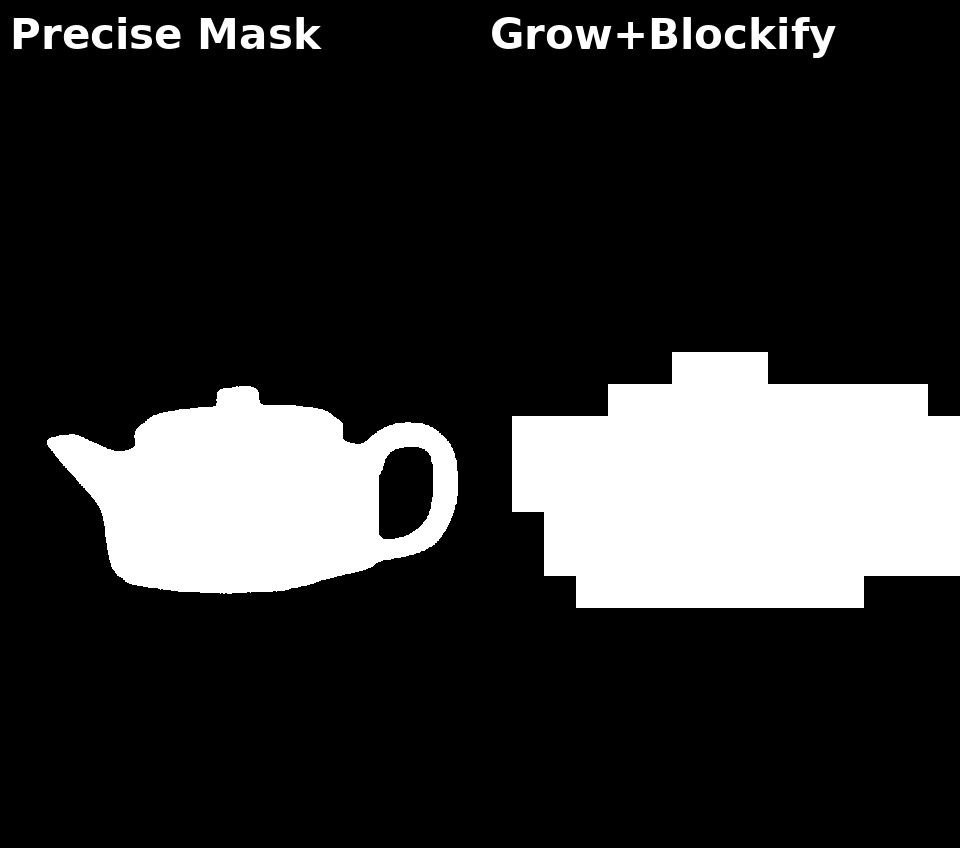
*图：Mask 预处理对比。GrowMask + BlockifyMask 处理后的 mask 边界更宽松、更方正。*

*图：预处理对比。处理后 mask 覆盖的灰色区域更大。*

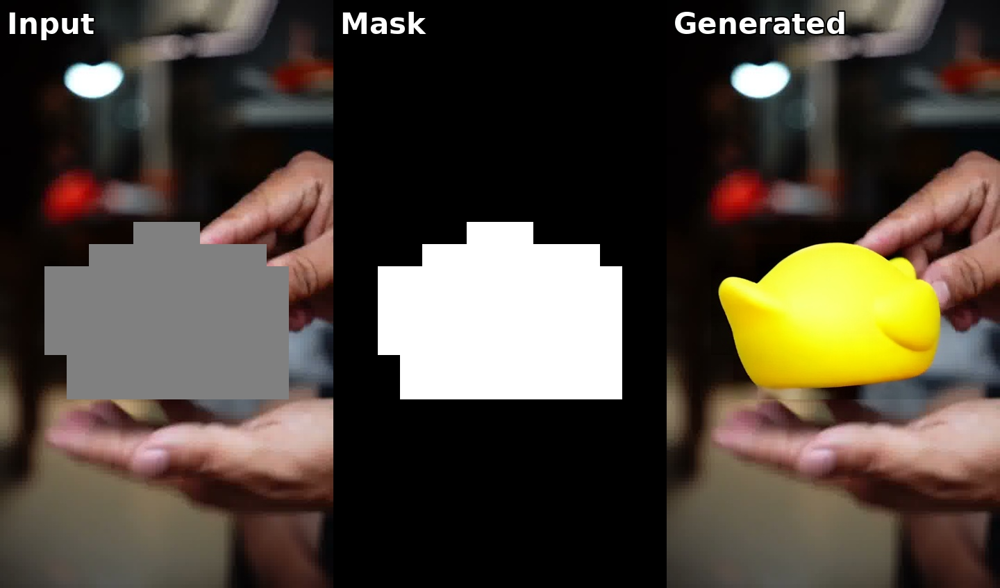
*图：生成结果对比。与 ComfyUI 工作流一致的 mask 处理在 14B 上仍无法产生满意结果。*

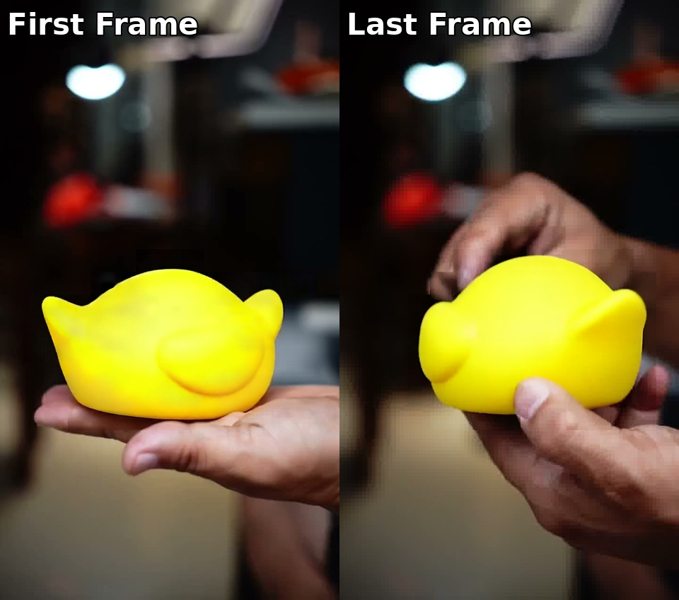
*图：首末帧展示。形状保真度和主体一致性均不达标。*

**分析**：GrowMask + BlockifyMask 在 14B 模型上的表现与在 1.3B 上类似，替换可以发生但质量无法满足 PVTT 项目要求。

---

### 4.8 实验八：ComfyUI 工作流 1:1 复刻

**实验配置**：
- 1:1 复刻 ComfyUI VACE 商品替换工作流（精度保持 bf16 而非 fp8）
- 参考图去背景：rembg + birefnet-general（对应 ComfyUI BiRefNetUltra 节点）
- 输入帧：中性色填充（fill_value=128）
- Mask：GrowMask(10px) + BlockifyMask(32px)
- LightX2V 蒸馏 LoRA：rank32, strength=1.0，**成功合并 405/405 层**
- 采样参数：CFG=6.0, CFG_Star=5.0, steps=1（完全对齐 ComfyUI 工作流参数）
- LoRA=YES, 单步采样
- 推理时间：~15s（得益于 LoRA 蒸馏的单步采样，推理速度极快）

**结果**：能把参考图像替换上去，但形状怪异，与原茶壶形状类似，且主体一致性保持非常差，无法满足 PVTT 项目要求。

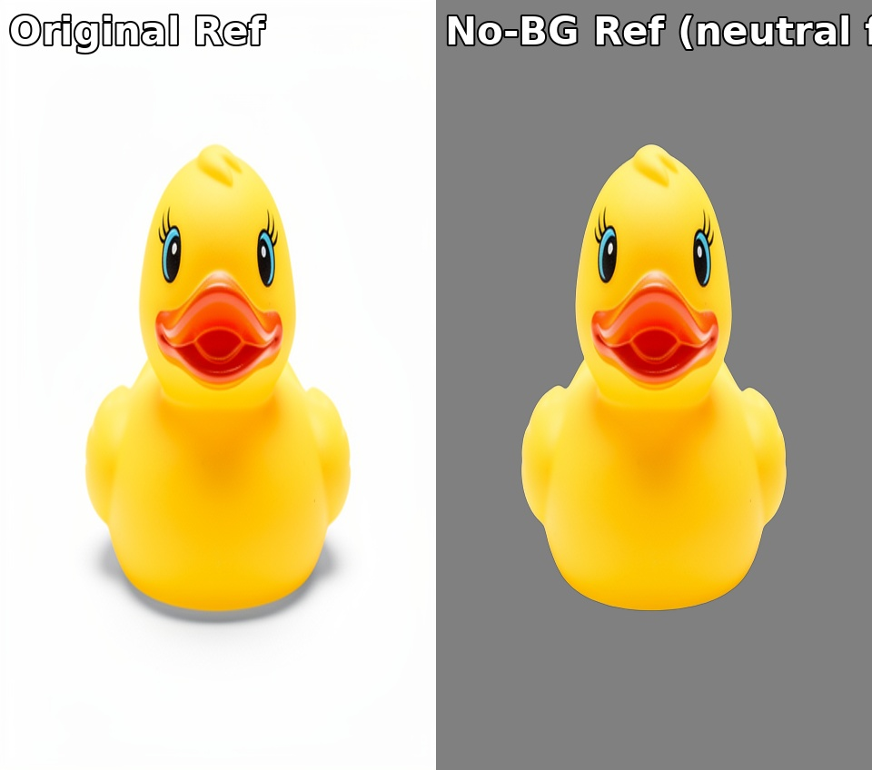
*图：参考图去背景处理对比。左为原始参考图，右为 BiRefNet 去背景后的结果。*

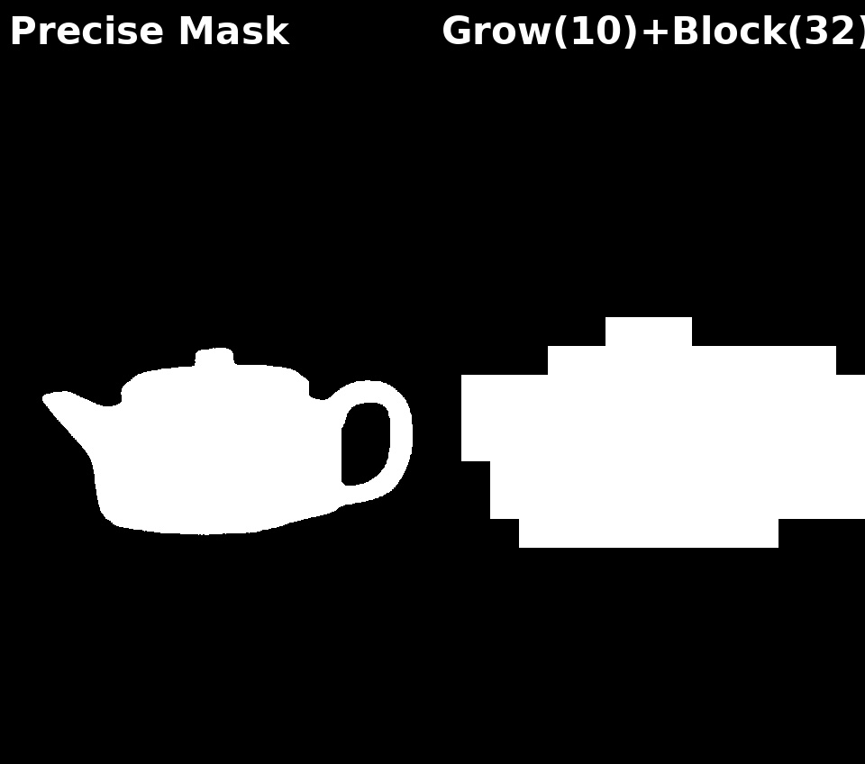
*图：Mask 预处理对比。原始精确 mask → GrowMask(10px) + BlockifyMask(32px) 处理后的 mask。*

*图：输入帧预处理对比。原始帧 vs 中性色填充后的帧。*

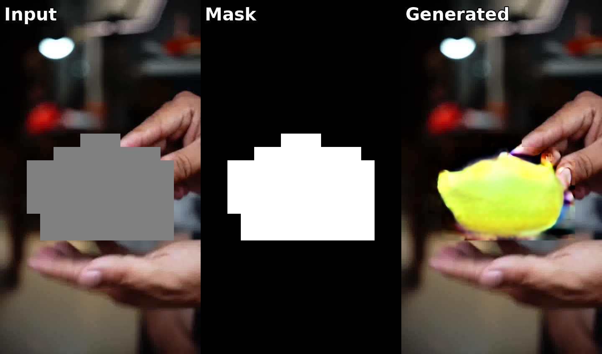
*图：生成结果对比。14B 模型成功加载 LoRA 并执行单步推理，替换发生但形状与原物品高度相似。*

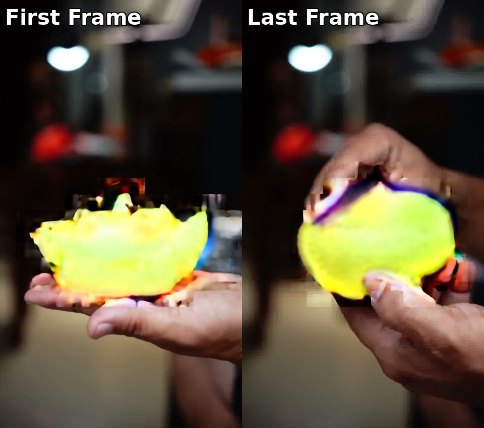
*图：首末帧展示。虽然有替换尝试，但生成的物体形状明显受原茶壶轮廓影响，主体一致性极差。*

**分析**：这是与 ComfyUI 工作流参数完全一致的对照实验（仅精度 bf16 vs fp8 不同）。14B 模型成功加载了 LightX2V 蒸馏 LoRA，实现了单步采样（仅 15 秒推理时间）。然而，即使完整复刻了 ComfyUI 的所有预处理步骤（参考图去背景、中性色填充、GrowMask+BlockifyMask）和采样参数（CFG=6.0, CFG_Star=5.0, steps=1），生成结果仍然无法满足 PVTT 要求：替换后的物体形状受原物体轮廓的强烈影响，且主体一致性极差。这表明 **ComfyUI 工作流在特定样本上的成功效果不具有普遍性**，VACE 模型架构在 zero-shot 条件下无法稳定实现高质量的商品替换。

---

## 5. 实验结果汇总对比

### 结果总览表

| 实验编号 | 输入策略 | 1.3B 结果 | 14B 结果 |
|---------|----------|-----------|----------|
| 实验1 | Source Video + Precise Mask | 完全未替换 | 完全未替换 |
| 实验2 | Source Video + Precise Mask + 流权重=0 | 可替换，形状/一致性差 | **完全未替换** |
| 实验3 | Source Video + Bbox Mask | 完全未替换 | 完全未替换 |
| 实验4 | Source Video + Bbox Mask + 流权重=0 | 可替换，形状/一致性差 | 可替换，形状/一致性差 |
| 实验5 | Mask Video + Precise Mask | 可替换，形状/一致性差 | **完全未替换** |
| 实验6 | Mask Video + Bbox Mask | 可替换，形状/一致性差 | 可替换，形状/一致性差 |
| 实验7 | Mask Video + GrowMask+BlockifyMask | 可替换，形状/一致性差 | 可替换，形状/一致性差 |
| 实验8 | ComfyUI 1:1 复刻（去背景+LoRA+单步） | 可替换，形状/一致性差 *(LoRA 失败)* | 可替换，形状/一致性差 *(LoRA 成功)* |
| 实验9 | Mask Video + 双参考图（商品图+Canny图） | 可替换，轻微提升但仍差 | *(未测试)* |
| **实验10** | **Mask Video + 首帧嵌入 Canny（白/黑）** | **质变提升，轮廓+细节基本还原** | *(未测试)* |

> 标注 **加粗** 的为关键突破实验。实验 9–10 仅在 1.3B 模型上完成。

### 推理性能对比

| 模型规模 | Pipeline 加载时间 | 单次推理时间 |
|---------|-----------------|-------------|
| 1.3B | ~26s - 83s | ~1min 19s |
| 14B | ~39s - 117s | ~4min 56s |

---

## 6. 结论与分析

### 核心发现（实验 1–8）

1. **Mask Video（中性色填充）输入是必要的**：如果输入原始 source video，模型完全无法做到目标替换——VACE 会将其视为"修复"任务，忠实还原被遮罩区域的原始内容。只有将 mask 区域填充为中性色（fill_value=128），消除原物体的像素信息，模型才有可能尝试替换。

2. **使用 Bounding Box Mask 是必要的**：对于 14B 模型，即使输入 mask video（中性色填充），如果使用精确分割 mask（precise mask），依然无法做到目标替换（实验 4.5）。必须使用 bounding box mask 或更宽松的 GrowMask+BlockifyMask，才能让模型有足够的"创作空间"来生成新物体。14B 模型对精确 mask 轮廓的感知能力更强，会从 mask 边界推断原物体形状并还原之。

3. **ComfyUI 工作流不具有普遍性**：ComfyUI 工作流或许在某些特定样本上能较好地实现目标替换，但在本次测试的茶壶→橡皮鸭场景中，即使完整复刻了所有预处理步骤和采样参数，主体一致性保持依然非常差。

4. **多视角参考图的潜在需求**：当前实验仅使用单张正面参考图，但原始视频中物体可能涉及旋转（如本次茶壶示例）。单视角参考图很难为模型提供足够的 3D 外观信息来应对多角度场景。

5. **主体一致性是核心瓶颈（实验 1–8）**：在前 8 组实验中，所有能够实现替换的实验，生成的目标物体在帧间的外观一致性都很差。这不是输入策略或采样参数能解决的问题，而是 VACE 模型架构在 subject-driven generation 上的根本局限。

### Canny 结构控制实验的发现（实验 9–10）

前 8 组实验的共同问题是：**即使实现了目标替换，外形轮廓和内部细节都非常糟糕。** 实验 9–10 尝试引入 Canny 结构控制图来施加强约束，结果揭示了关键规律：

6. **结构信息的注入位置至关重要**：同样是 Canny 边缘图，通过参考图传入（实验九）几乎无效，而嵌入视频首帧的 mask 区域（实验十）则带来**质变级的提升**。这证实了 VACE 以首帧为锚点生成后续帧的工作方式——**首帧的结构信息直接决定了整个视频的主体一致性。**

7. **首帧 Canny 嵌入是当前最优方案**：实验十的效果远超前 9 组实验，生成的鸭子在外形轮廓和内部细节上基本还原了参考图像。虽然局部细节仍有提升空间，但已经从"完全不可用"跃迁到"基本可用"。

8. **线条颜色不影响生成质量，但会引入副作用**：白色线条和黑色线条在主体还原度上无显著差异，但白色线条导致鸭子底部意外长出"脚"，黑色线条导致底部出现黑色"底盘"。推测模型将线条颜色对比当作了局部语义提示。

### 对 PVTT 项目的阶段性结论

实验 1–8 的结论：**Wan2.1-VACE 在纯 zero-shot 条件下（仅靠参考图+文本+mask 策略调整）无法满足 PVTT 要求**，主体一致性是根本瓶颈。

实验 10 的突破：**在视频首帧 mask 区域嵌入 Canny 结构控制图后，主体一致性获得质变提升**，证明了结构引导 + 首帧锚定的有效性。这为后续研究提供了一条可行路径。

### 后续研究方向

基于实验十的突破，后续可沿以下方向继续探索：

**方向一：对每帧 mask 区域嵌入结构控制图**

- 设想：类比 SAM2 根据首帧 mask 传播生成后续帧 mask 的思路，能否根据首帧 mask 区域内的结构控制图，传播生成后续所有帧的结构控制图？
- 困难：随着视频进行，目标的视角、姿态可能发生变化，每帧的控制图需要准确反映这些变化。但用户只提供一个或几个视角的产品图，如何生成任意视角的结构控制图？（靠 3D 重建可能可以实现，但工作流变得繁重。）如何确定每帧对应的视角？这些都是棘手的问题。

**方向二：添加控制图注入通道，实现多控制图条件注入**

- 动机：当前仅在首帧 mask 区域嵌入了单一的 Canny 控制图。如果添加专门的控制图注入通道，支持同时注入 depth、softedge、canny、色彩分布图等多种控制信号，是否能进一步提升效果？
- 可行性待验证：需要对模型架构进行较大调整。

**是否有继续深入研究的必要？**：

1. **首帧控制图方法的泛化性**：当前实验中，参考图的视角与视频首帧展示的视角恰好大致匹配。但如果用户只提供产品正面图，而视频第一帧展示的是产品侧面，首帧嵌入的 Canny 图就与实际需要的视角不一致，方法可能失效。

2. **VACE 首帧编辑 vs 专业图像编辑模型**：首帧 Canny 嵌入本质上是在让 VACE 做"首帧条件生成"，其效果能否比肩主流图像编辑模型（如 InstructPix2Pix、AnyDoor 等）？
   - 如果 VACE 的首帧生成效果**优于**专业图像编辑模型 → 方向确定，继续深入（但可能性不大，毕竟专业模型是为图像编辑专门设计的）
   - 如果 VACE 的首帧效果**远逊于**专业图像编辑模型 → 不如采用 training-free 两阶段方案（图像编辑模型做首帧 + VACE 做视频传播），无需继续在 VACE 首帧编辑上花精力
   - 如果 VACE 的首帧效果**略逊于**专业图像编辑模型 → 需要权衡：training-free 方案多引入一个模型增加了工作链路和开销，而 VACE 是 all-in-one，如果差距不大则 VACE 方案更具实用价值
