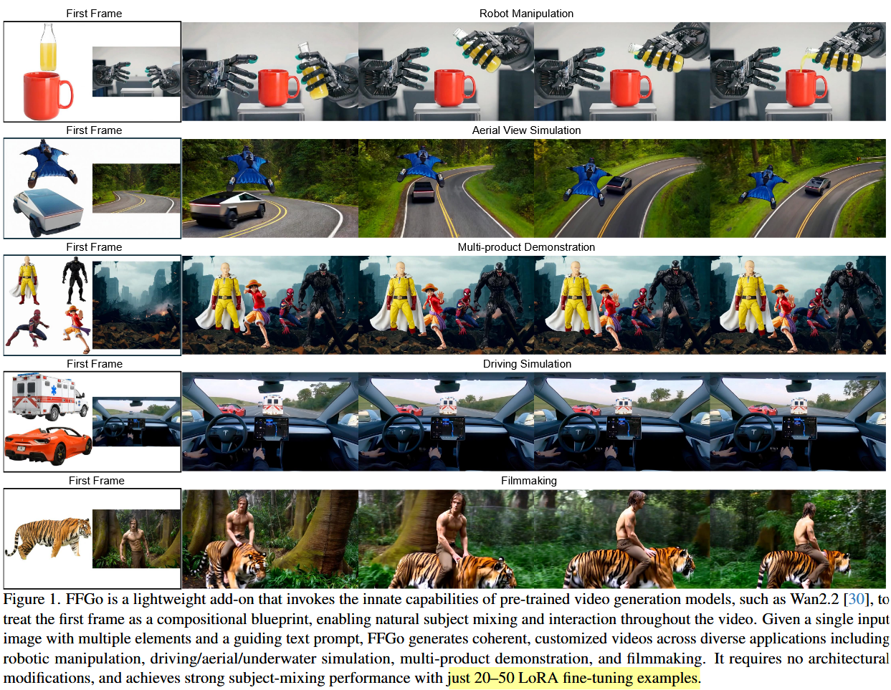

# PVTT 实验报告：VACE I2V + FFGo 首帧参考

## 1. 背景与动机

### 1.1 First Frame Is the Place to Go (FFGo) 论文简介

**"First Frame Is the Place to Go for Video Content Customization"** 提出了一种轻量、无需改造模型架构的视频内容定制方法，其核心思想和关键点如下：

**核心思想：首帧即概念记忆缓冲区**

该论文将视频的首帧视为模型的"概念记忆缓冲区"（Concept Memory Buffer）。底座视频生成模型（如 Wan I2V）在海量视频数据上训练时，已经涌现出了强大的"参考首帧、保持一致性"的能力——模型天然会在后续帧的生成中参考首帧里出现的物体、场景和风格。FFGo 利用这一涌现能力，通过精心构造首帧的内容，来控制后续视频的生成。

**输入格式**

FFGo 的首帧采用拼贴式构造：将目标概念（如产品图）和场景参考（如背景画面）并排放置在首帧中。模型接收这个拼贴首帧后，在后续帧中自然地将两者融合，生成包含目标物体的连贯视频。

**转场机制**

由于首帧是拼贴式的非自然画面，模型需要从首帧"转场"到自然画面。论文在 prompt 中加入转场提示词（如"The camera view suddenly changes."），引导模型在前几帧完成从拼贴画面到自然视频的过渡。最终使用的视频是裁掉转场帧（通常前 4 帧）后的部分。

**轻量微调**

FFGo 不需要改造模型架构，仅需在约 50 个精选数据集上对底座模型做 LoRA 微调，即可显著提升首帧参考的保持能力和转场的稳定性。

**与本研究的关联**

FFGo 论文基于 Wan I2V 模型进行微调，与我们研究使用的 Wan2.1-VACE 同属 Wan 系列模型家族，其思想和结论对我们的 PVTT 任务有直接参考价值。

### 1.2 本实验动机

在前期 VACE 直接目标替换实验中，我们发现了诸多问题（画面滚动、噪声闪烁、mask 导致的割裂感等）。因此，我们尝试一种不同的思路：**不在原视频上做局部替换，而是借鉴 FFGo 的首帧参考方法，让 VACE 模型从首帧出发重新生成整个视频**。

本次实验是一次**零微调的直接测试**——我们没有对模型做任何 LoRA 微调，没有改造模型架构，仅使用原始的 VACE 1.3B 模型配合 FFGo 风格的首帧输入，测试其在 PVTT 任务上的表现。

---

## 2. 实验配置

### 2.1 模型与参数

| 配置项 | 值 |
|--------|------|
| 模型 | Wan2.1-VACE 1.3B |
| 生成帧数 | 81 |
| FPS | 16 |
| 推理步数 | 50 |
| CFG Scale | 7.5 |
| Seed | 42 |
| 物体移除方式 | LaMa（膨胀 3px） |
| 转场丢弃 | SSIM 自动检测（阈值 0.85） |
| 采样任务数 | 23（8 种产品类别） |

### 2.2 输入格式

| 输入项 | 说明 |
|--------|------|
| **首帧（ref image）** | FFGo 式拼贴首帧：左侧放置产品 RGBA 图（白底），右侧放置原视频首帧去除被替换物体后的画面（居中显示，不铺满右侧） |
| **Mask 序列** | 首帧 mask = 全 0（不做改变，保留首帧内容）；后续帧 mask = 全 1（全部由模型重新生成） |
| **Prompt** | 转场提示词 + 原始目标 prompt。格式：`"The camera view suddenly changes. {target_prompt}"` |

### 2.3 处理流程

1. 加载原视频首帧和首帧 mask
2. 加载 RGBA 干净产品图（从 `output_dino_rgba/`）
3. 使用 LaMa 模型从首帧中去除被替换物体，得到干净背景
4. 构造 FFGo 式首帧：左半=产品白底图，右半=干净背景（居中）
5. 构造 mask 序列：首帧全黑（保留），后续帧全白（生成）
6. VACE 推理
7. SSIM 自动检测转场结束帧，裁掉转场帧
8. 保存结果

### 2.4 输出

| 文件 | 说明 |
|------|------|
| `ffgo_i2v.mp4` | 裁掉转场后的有效视频 |
| `ffgo_i2v_full.mp4` | 含转场的完整视频 |
| `ffgo_i2v_comparison.jpg` | [原视频首帧 \| FFGo 输入首帧 \| target 首帧] 三列对比 + prompt |
| `ffgo_i2v_showcase.jpg` | [target 首帧 \| target 尾帧] |
| `ffgo_ref_frame.jpg` | FFGo 输入首帧（供检查） |

实验结果目录：`experiments/results/1.3B/pvtt_ffgo_i2v/20260313_172641`

> 注：`easy_0032-watch2_to_watch1` 因实验意外中断，结果部分丢失。

---

## 3. 实验结果

### 3.1 Part 1：Bracelet / Earring / Handbag / Handfan

### 3.2 Part 2：Necklace / Purse / Sunglasses / Watch

### 3.3 各任务转场检测情况

| 任务 ID | 转场结束帧 | SSIM |
|---------|-----------|------|
| 0001-handfan1_to_handfan2 | 第 4 帧 | 0.991 |
| 0002-handfan2_to_handfan1 | 第 5 帧 | 0.896 |
| 0003-sunglasses1_scene01_to_sunglasses2 | 第 4 帧 | 0.989 |
| 0003-sunglasses1_scene02_to_sunglasses2 | 第 4 帧 | 0.951 |
| 0004-sunglasses2_to_sunglasses1 | 第 4 帧 | 0.960 |
| 0006-handbag1_scene01_to_handbag2 | 第 10 帧 | 0.867 |
| 0006-handbag1_scene06_to_handbag2 | 第 5 帧 | 0.997 |
| 0007-handbag2_to_handbag1 | 第 4 帧 | 0.983 |
| 0012-purse1_to_purse2 | 第 4 帧 | 0.977 |
| 0013-purse2_to_purse1 | 第 6 帧 | 0.896 |
| 0014-purse3_scene01_to_purse1 | 第 5 帧 | 0.852 |
| 0016-bracelet1_to_bracelet2 | 第 4 帧 | 0.996 |
| 0017-bracelet2_scene01_to_bracelet1 | 第 5 帧 | 0.978 |
| 0017-bracelet2_scene02_to_bracelet1 | 第 16 帧 | 0.890 |
| 0021-earring1_to_earring2 | 第 20 帧 | 0.991 |
| 0022-earring2_to_earring1 | 第 11 帧 | 0.999 |
| 0023-earring3_scene01_to_earring1 | 第 4 帧 | 0.996 |
| 0026-necklace1_to_necklace2 | 第 5 帧 | 0.988 |
| 0027-necklace2_to_necklace1 | 第 5 帧 | 0.885 |
| 0028-necklace3_scene01_to_necklace1 | 第 6 帧 | 0.946 |
| 0031-watch1_to_watch2 | 第 5 帧 | 0.999 |
| 0033-watch3_scene02_to_watch1 | 第 4 帧 | 0.989 |

---

## 4. 结果分析

### 4.1 优点

#### 产品主体一致性显著提升

相比 VACE 直接目标替换实验（杂乱噪声/闪烁/滚动），FFGo 首帧参考方式生成的视频中，**产品的外观一致性非常好**。模型能够从首帧中"记住"产品的颜色、形状、纹理等特征，并在后续帧中较好地保持。这验证了 FFGo 论文的核心观点：底座模型确实具备从首帧参考概念的涌现能力。

#### 画面流畅自然

由于不是在原视频上做生硬的局部替换（用 mask 划定区域、合成拼接），而是让模型从首帧出发**整体重新生成**视频，因此生成的画面过渡更加流畅、自然、合理。不存在直接替换方案中的 mask 边界割裂、画面滚动等问题。

### 4.2 不足之处

#### 4.2.1 LaMa 物体去除效果粗糙

当前使用 LaMa 模型去除首帧中被替换物体的效果较为粗糙，类似于"橡皮擦擦除"，去除区域的纹理填充不够精细。这会影响右侧背景画面的质量，进而影响模型对场景的理解。后续可考虑使用更先进的 inpainting 模型（如 SD Inpainting、ProPainter 等）优化此步骤。

#### 4.2.2 少数产品一致性保持不理想

尽管总体表现良好，但仍有少数案例中产品的细节特征未能完美还原：

- **`easy_0026-necklace1_to_necklace2`**：参考产品为海马形状的项链坠，但生成视频中的项链坠形状偏差较大，海马造型的细节未能还原

- **`easy_0001-handfan1_to_handfan2`**：生成的背景画面与首帧右侧提供的场景参考差别较大

**原因分析：**

1. **模型能力限制**：VACE 1.3B 的参数量相对有限，对复杂几何形状（如海马造型）的"记忆"和还原能力不足。未经 LoRA 微调的模型对首帧参考的依赖程度有限，容易在生成过程中"遗忘"首帧中的细节特征
2. **提示词不够详细**：当前的 prompt 对产品外观的描述可能不够精确。模型同时需要从 prompt 和首帧两个信号源获取信息，当 prompt 对关键细节（如"seahorse-shaped pendant"）的描述不足时，模型可能倾向于生成更常见/简单的形态
3. **首帧构造的局限**：产品图和背景图的拼贴方式较为简单（左右并排），模型需要自行理解"左侧的物体应该出现在右侧的场景中"，这一隐含语义的理解能力在未微调模型中可能不够强

**可能的改进方向：**

- **LoRA 微调**：参考 FFGo 论文的方法，在精选数据集上做 LoRA 微调，加强模型对首帧中产品和场景的参考保持力度。微调可以让模型学会更稳定地从首帧拼贴中提取概念并在后续帧中复现
- **优化提示词**：使用 VLM（视觉语言模型）对参考产品图的细节特征（材质、颜色、形状、纹理）、场景画面的风格、原视频的运镜方式等进行详细分析，生成更精确的提示词。更丰富的文本描述可以与视觉信号相互补充，提升一致性

#### 4.2.3 转场问题

转场是 FFGo 方法的关键环节，当前实验暴露了几个转场相关的问题：

**转场不自然/不干净**

部分样例的转场效果不理想：
- `easy_0004-sunglasses2_to_sunglasses1`：转场过渡不自然
- `easy_0003-sunglasses1_scene02_to_sunglasses2`：转场不够干净，残留拼贴画面痕迹

**转场完成帧不可控**

当前使用固定的转场提示词 `"The camera view suddenly changes."`，但不同任务的转场速度差异很大：

| 转场速度 | 典型案例 | 转场帧数 |
|----------|---------|---------|
| 快速（理想） | 0023-earring3_scene01 | 4 帧 |
| 中等 | 0006-handbag1_scene01 | 10 帧 |
| 缓慢 | 0017-bracelet2_scene02 | 16 帧 |
| 极慢 | 0021-earring1_to_earring2 | 20 帧 |

转场帧过多意味着有效视频帧减少。81 帧生成中如果 20 帧用于转场，有效视频仅剩 61 帧（约 3.8 秒 @16fps），利用率仅 75%。

**可能的改进方向：**

- **测试多组转场提示词**：尝试不同的转场描述（如 `"Cut to"`, `"Scene changes to"`, `"Transition to"` 等），测试哪种提示词能让模型更快速、更干净地完成转场
- **LoRA 微调学习转场**：参考 FFGo 论文，通过微调让模型学会在固定帧数（如 4 帧）内稳定完成转场，消除转场速度的不确定性

---

## 5. 对 PVTT 项目的启示

### 5.1 从"目标替换"到"风格化重生成"的思路转变

前期 VACE 直接目标替换实验揭示了在原视频上做局部目标替换存在的根本性困难：

| 问题 | 说明 |
|------|------|
| **Mask 问题** | 逐帧 bbox 漂移导致画面滚动，mask 帧数不足导致噪声闪烁，大面积 mask 导致丢失原视频上下文 |
| **语义冲突** | 不同类型产品需要不同使用姿势（如斜挎包→手提包），强行替换画面不自然 |
| **物体与环境纠缠** | 被替换物体与模特/道具紧密交织，mask 不可避免地破坏周围元素 |

FFGo 首帧参考方案提供了一种全新的思路：

> **产品图 + 模板视频 → 生成风格相似的全新宣传视频**

即：不再试图"在原视频上精确替换某个物体"，而是将原视频作为**风格/场景模板**，结合目标产品图，让模型从首帧出发**重新生成一段风格、画面、运镜都与模板相似的全新宣传视频**。【对原视频做1：1还原 -> 将原视频视作prompt参考】

### 5.2 两种方案的对比

| 维度 | VACE 直接替换 | FFGo 首帧参考 |
|------|--------------|--------------|
| 目标 | 精确替换原视频中的物体 | 参考模板生成相似风格的新视频 |
| 原视频利用 | 作为基底，保留非 mask 区域 | 仅作为风格/场景参考 |
| 画面连贯性 | mask 边界割裂，滚动/闪烁 | 全帧生成，流畅自然 |
| 产品一致性 | 较差（受 mask 区域限制） | 较好（首帧作为参考） |
| 语义合理性 | 可能出现姿势/场景不匹配 | 模型自由生成合理画面 |
| 局限性 | mask 质量严重影响效果 | 转场质量、微调需求 |

### 5.3 后续优化方向

1. **LoRA 微调**：在精选数据集上微调 VACE 模型，提升首帧参考保持能力和转场稳定性
2. **提示词优化**：引入 VLM 自动生成详细的产品描述和场景分析
3. **更大模型**：测试 VACE 14B 是否能提升产品一致性和画面质量
4. **首帧构造优化**：探索更好的产品图+场景图拼贴方式
5. **Inpainting 优化**：替换 LaMa 为更精细的 inpainting 模型

---

## 6. 结论

本次实验验证了 FFGo 首帧参考方法在 PVTT 任务上的可行性。即使在**未经任何微调**的情况下，VACE 1.3B 模型已经展现出了从首帧参考产品和场景的涌现能力，生成的视频在产品一致性和画面自然度上均显著优于直接目标替换方案。

主要发现：
- **产品一致性好**：模型能从首帧"记住"产品外观并在视频中保持
- **画面流畅自然**：全帧生成避免了 mask 导致的割裂和滚动问题
- **仍有提升空间**：少数任务的一致性和转场效果需要通过微调和提示词优化来改善
- **新思路**：从"精确替换"转向"风格化重生成"，可能是 PVTT 更合理的技术路径
