# PVTT 实验报告：FFGo 原版模型（Wan2.2-I2V-A14B + LoRA）

## 1. 实验概述

使用 FFGo 论文的原版模型（Wan2.2-I2V-A14B + FFGo LoRA adapter）在 PVTT 数据集上进行首帧引导视频生成测试。

### 实验配置

| 配置项 | 值 |
|--------|------|
| 模型 | Wan2.2-I2V-A14B + FFGo LoRA (low-noise + high-noise) |
| 分辨率 | 832×480 |
| 生成帧数 | 81 |
| FPS | 16 |
| 推理步数 | 50 |
| Guidance Scale | 6.0 |
| Seed | 42 |
| Prompt 前缀 | `ad23r2 the camera view suddenly changes.` |
| 物体移除 | LaMa（膨胀 3px） |
| 采样任务 | 30 个（8 种产品，每种 2~4 个） |

### 输入格式

- **首帧（ref image）**：FFGo 式拼贴（左=产品 RGBA 白底图，右=原视频首帧去除物体后的画面居中）
- **Mask**：首帧全 0（保留），后续帧全 1（生成）
- **Prompt**：`ad23r2 the camera view suddenly changes. {target_prompt}`

### 实验结果目录

| 批次 | 目录 | 说明 |
|------|------|------|
| 第一批 | `results/ffgo_original/pvtt/20260317_165346` | 每种产品 2 个样例（共 16 个） |
| 第二批 | `results/ffgo_original/pvtt/20260317_185832` | 每种产品 2 个新样例（共 14 个，handfan 无新样例） |

---

## 2. 实验结果

> 每个样例展示两部分：
> - **动图行**：原视频 GIF | FFGo 输入首帧 | 生成视频 GIF
> - **静态行**：FFGo 输入首帧 | 转场后第 1 帧 | 第 21 帧 | 第 51 帧 | 第 81 帧

### 2.1 Bracelet（手链）

---

**0016-bracelet1_to_bracelet2**

| 原视频 | FFGo 输入首帧 | 生成视频 |
|:---:|:---:|:---:|
| 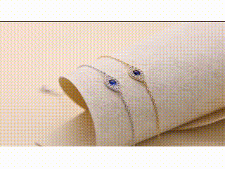 |  | 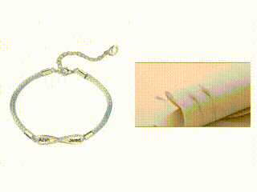 |

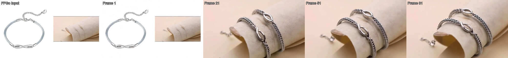

> **Prompt**: ad23r2 the camera view suddenly changes. Two couple bracelets displayed, on cream leather jewelry roll, bracelets positioned diagonally across curved display surface in center of frame, against soft beige/pink gradient background, soft diffused studio lighting. The camera slowly zooms in on jewelry detail.

---

**0017-bracelet2_scene01_to_bracelet1**

| 原视频 | FFGo 输入首帧 | 生成视频 |
|:---:|:---:|:---:|
| 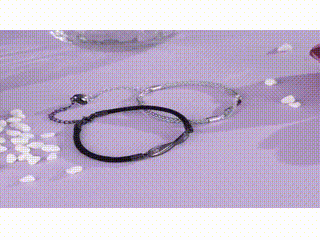 |  | 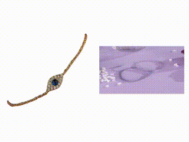 |

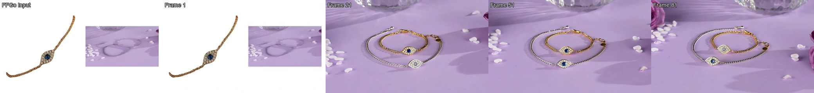

> **Prompt**: ad23r2 the camera view suddenly changes. Two delicate chain bracelets (silver and gold) with evil eye blue sapphire charms displayed on purple satin fabric, bracelets positioned in center forming slight arc, white heart-shaped petals scattered around, crystal glass visible at top, soft studio lighting with purple tone, slow orbit movement. The camera remains static shot.

---

**0016-bracelet1_to_bracelet3**

| 原视频 | FFGo 输入首帧 | 生成视频 |
|:---:|:---:|:---:|
|  |  | 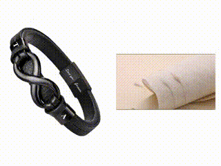 |

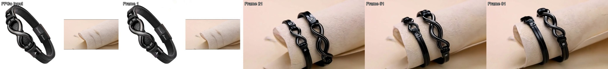

> **Prompt**: ad23r2 the camera view suddenly changes. Two black leather infinity bracelets displayed, on cream leather jewelry roll, bracelets positioned diagonally across curved display surface in center of frame, against soft beige/pink gradient background, soft diffused studio lighting. The camera slowly zooms in on jewelry detail.

---

**0016-bracelet1_to_bracelet4**

| 原视频 | FFGo 输入首帧 | 生成视频 |
|:---:|:---:|:---:|
|  |  | 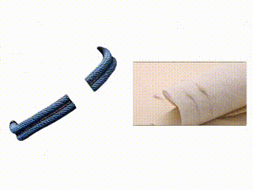 |

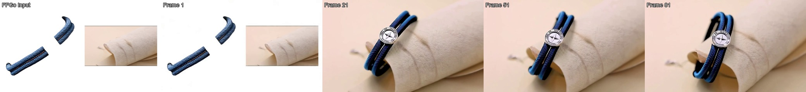

> **Prompt**: ad23r2 the camera view suddenly changes. A black paracord bracelet with silver compass charm displayed, on cream leather jewelry roll, bracelets positioned diagonally across curved display surface in center of frame, against soft beige/pink gradient background, soft diffused studio lighting. The camera slowly zooms in on jewelry detail.

---

### 2.2 Earring（耳环）

---

**0021-earring1_to_earring2**

| 原视频 | FFGo 输入首帧 | 生成视频 |
|:---:|:---:|:---:|
| 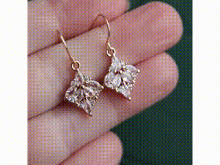 |  | 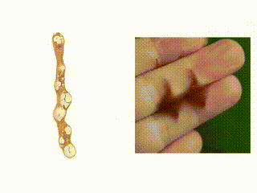 |

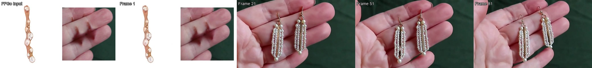

> **Prompt**: ad23r2 the camera view suddenly changes. White pearl cascade drop earrings held between fingers, earrings in center of frame dangling from fingertips, fingers entering from top, dark green fabric background, soft natural lighting. The camera remains static with slight earring movement/swing.

---

**0022-earring2_to_earring1**

| 原视频 | FFGo 输入首帧 | 生成视频 |
|:---:|:---:|:---:|
| 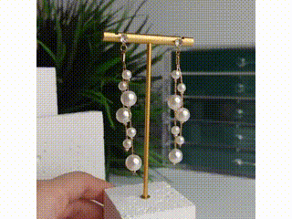 |  | 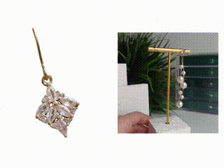 |

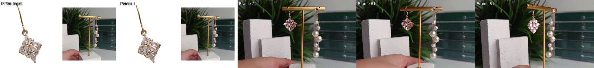

> **Prompt**: ad23r2 the camera view suddenly changes. Rose gold crystal flower cluster dangle earrings displayed on gold T-bar stand, earrings hanging in center of frame, stand placed, on white concrete blocks, green plant foliage background, soft diffused lighting, hand touching stand from bottom-left. The camera remains static product display.

---

**0021-earring1_to_earring3**

| 原视频 | FFGo 输入首帧 | 生成视频 |
|:---:|:---:|:---:|
|  |  | 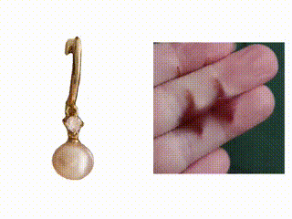 |

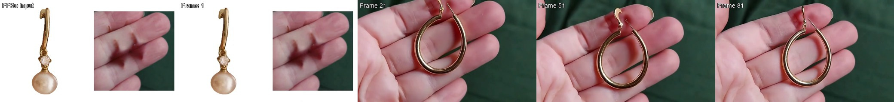

> **Prompt**: ad23r2 the camera view suddenly changes. Gold hoop earring with pearl held between fingers, earrings in center of frame dangling from fingertips, fingers entering from top, dark green fabric background, soft natural lighting. The camera remains static with slight earring movement/swing.

---

**0021-earring1_to_earring4**

| 原视频 | FFGo 输入首帧 | 生成视频 |
|:---:|:---:|:---:|
|  |  | 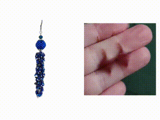 |

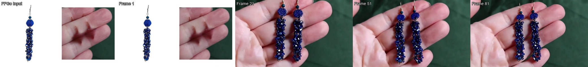

> **Prompt**: ad23r2 the camera view suddenly changes. Blue lapis lazuli beaded cluster dangle earrings held between fingers, earrings in center of frame dangling from fingertips, fingers entering from top, dark green fabric background, soft natural lighting. The camera remains static with slight earring movement/swing.

---

### 2.3 Handbag（手提包）

---

**0006-handbag1_scene01_to_handbag2**

| 原视频 | FFGo 输入首帧 | 生成视频 |
|:---:|:---:|:---:|
|  |  | 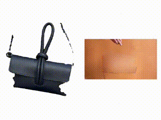 |

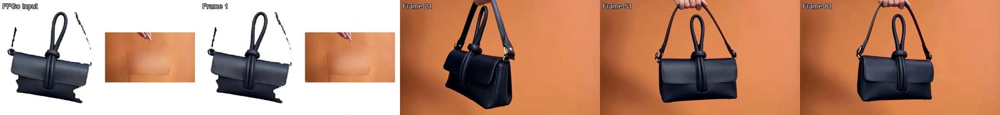

> **Prompt**: ad23r2 the camera view suddenly changes. A black leather mini crossbody bag with knotted handle held by fingertips at top handle, bag centered in frame occupying lower two-thirds, hand entering from top, solid orange studio backdrop, even studio lighting. The camera remains static display.

---

**0007-handbag2_to_handbag1** ⚠️ 产品一致性较差——提示词描述为"gray pebbled leather doctor bag with detachable shoulder strap"，与实际目标产品（handbag_1）不符，导致模型生成了提示词描述的包而非参考图中的包。

| 原视频 | FFGo 输入首帧 | 生成视频 |
|:---:|:---:|:---:|
| 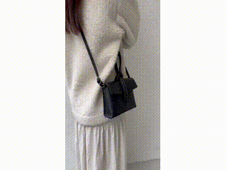 |  | 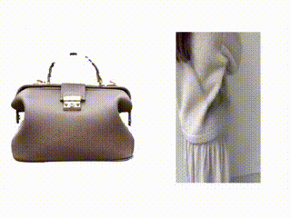 |

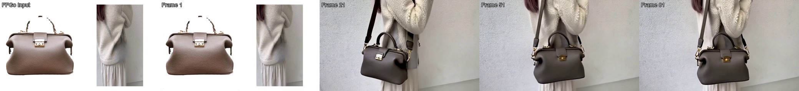

> **Prompt**: ad23r2 the camera view suddenly changes. A gray pebbled leather doctor bag with detachable shoulder strap being shown, hand holding strap worn by woman, bag positioned at hip level in center-right of frame, model wearing cream sherpa jacket and beige skirt, white textured wall background, soft natural indoor lighting. The camera remains static lifestyle shot.

---

**0006-handbag1_scene01_to_handbag3**

| 原视频 | FFGo 输入首帧 | 生成视频 |
|:---:|:---:|:---:|
|  |  | 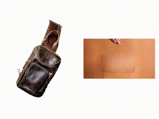 |

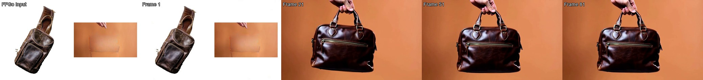

> **Prompt**: ad23r2 the camera view suddenly changes. A brown leather messenger sling bag held by fingertips at top handle, bag centered in frame occupying lower two-thirds, hand entering from top, solid orange studio backdrop, even studio lighting. The camera remains static display.

---

**0006-handbag1_scene01_to_handbag4**

| 原视频 | FFGo 输入首帧 | 生成视频 |
|:---:|:---:|:---:|
| 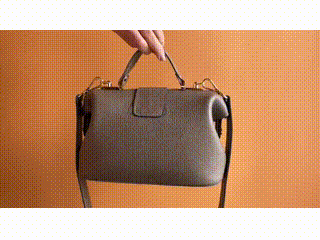 |  | 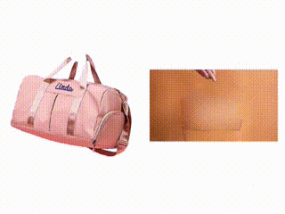 |

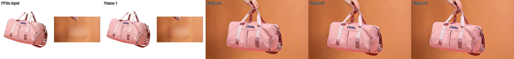

> **Prompt**: ad23r2 the camera view suddenly changes. A pink nylon duffle gym bag held by fingertips at top handle, bag centered in frame occupying lower two-thirds, hand entering from top, solid orange studio backdrop, even studio lighting. The camera remains static display.

---

### 2.4 Handfan（扇子）

---

**0001-handfan1_to_handfan2**

| 原视频 | FFGo 输入首帧 | 生成视频 |
|:---:|:---:|:---:|
| 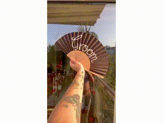 |  | 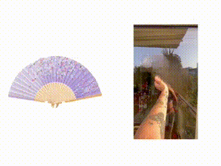 |

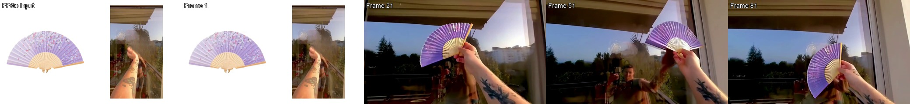

> **Prompt**: ad23r2 the camera view suddenly changes. A purple fabric hand fan with cherry blossom pattern held by tattooed hand in upper center of frame, arm extending from bottom-left corner diagonally, outdoor balcony background with glass reflection and sky, natural daylight, slight. The camera pans right with hand movement.

---

**0002-handfan2_to_handfan1**

| 原视频 | FFGo 输入首帧 | 生成视频 |
|:---:|:---:|:---:|
| 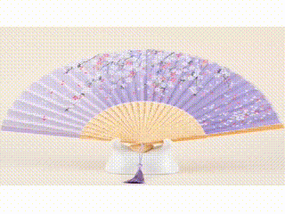 |  | 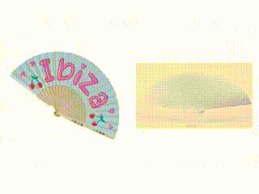 |

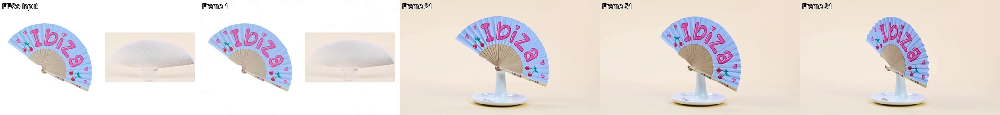

> **Prompt**: ad23r2 the camera view suddenly changes. A brown wooden hand fan with 'Groom' text displayed, on white ceramic stand centered in frame, fan occupying upper two-thirds of frame, against solid cream background, soft studio lighting, slow. The camera orbits around the subject rotation around product.

---

### 2.5 Necklace（项链）

---

**0026-necklace1_to_necklace2**

| 原视频 | FFGo 输入首帧 | 生成视频 |
|:---:|:---:|:---:|
| 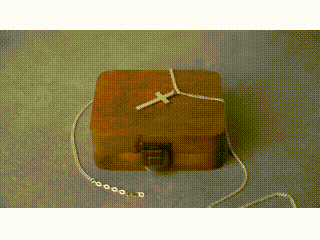 |  | 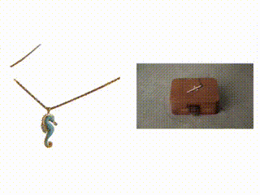 |

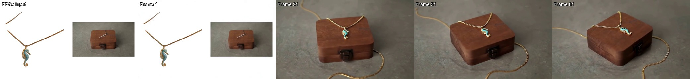

> **Prompt**: ad23r2 the camera view suddenly changes. A gold chain necklace with turquoise seahorse pendant displayed draped over brown wooden jewelry box, necklace and box centered in frame, chain trailing down front of box onto gray stone surface, soft diffused studio lighting, static product display. The camera remains static shot.

---

**0027-necklace2_to_necklace1**

| 原视频 | FFGo 输入首帧 | 生成视频 |
|:---:|:---:|:---:|
| 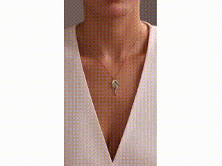 |  | 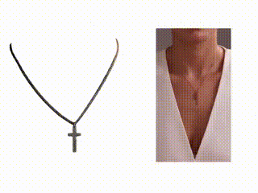 |

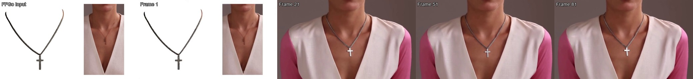

> **Prompt**: ad23r2 the camera view suddenly changes. A silver chain necklace with minimalist cross pendant worn around neck, pendant centered in frame on chest, model wearing pink/white V-neck top, gray studio background visible at top, soft studio lighting, static close-up shot. The camera remains static shot.

---

**0026-necklace1_to_necklace3**

| 原视频 | FFGo 输入首帧 | 生成视频 |
|:---:|:---:|:---:|
|  |  | 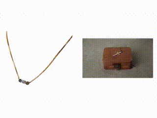 |

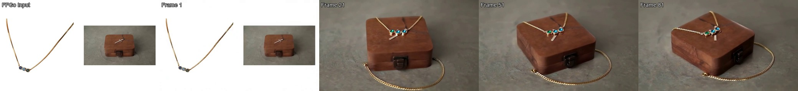

> **Prompt**: ad23r2 the camera view suddenly changes. A gold box chain necklace with three bezel-set gemstones (blue and green) displayed draped over brown wooden jewelry box, necklace and box centered in frame, chain trailing down front of box onto gray stone surface, soft diffused studio lighting, static product display. The camera remains static shot.

---

**0026-necklace1_to_necklace4** ⚠️ 产品一致性较差——提示词描述为"gold chain necklace with pearl drops and red flower charms"，对目标产品（necklace_4）的细节描述不够准确，模型未能还原产品的具体形态特征。

| 原视频 | FFGo 输入首帧 | 生成视频 |
|:---:|:---:|:---:|
|  |  | 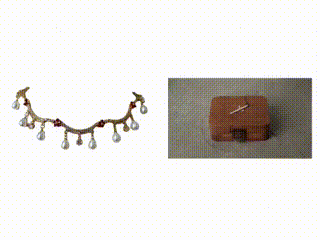 |

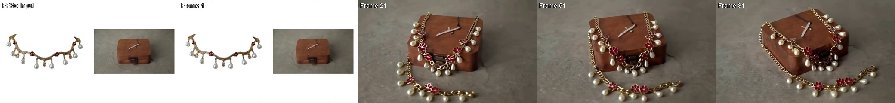

> **Prompt**: ad23r2 the camera view suddenly changes. A gold chain necklace with pearl drops and red flower charms displayed draped over brown wooden jewelry box, necklace and box centered in frame, chain trailing down front of box onto gray stone surface, soft diffused studio lighting, static product display. The camera remains static shot.

---

### 2.6 Purse（钱包）

---

**0012-purse1_to_purse2**

| 原视频 | FFGo 输入首帧 | 生成视频 |
|:---:|:---:|:---:|
|  |  | 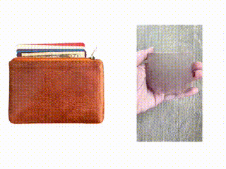 |

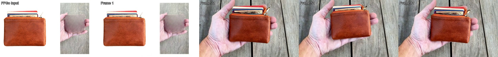

> **Prompt**: ad23r2 the camera view suddenly changes. A brown leather zip pouch wallet held flat in open palm, purse centered in frame, hand entering from bottom, weathered gray wood plank background, natural daylight. The camera remains static display with slight hand tilt to show details.

---

**0013-purse2_to_purse1**

| 原视频 | FFGo 输入首帧 | 生成视频 |
|:---:|:---:|:---:|
| 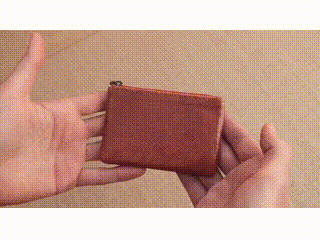 |  | 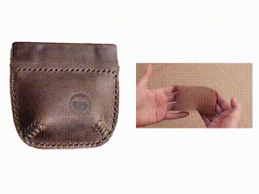 |


> **Prompt**: ad23r2 the camera view suddenly changes. A dark brown hand-stitched leather coin purse held by both hands, hands framing product from left and right sides, beige linen fabric background, soft natural lighting. The camera remains static with hands demonstrating size.

---

**0012-purse1_to_purse3**

| 原视频 | FFGo 输入首帧 | 生成视频 |
|:---:|:---:|:---:|
|  |  |  |


> **Prompt**: ad23r2 the camera view suddenly changes. A brown leather crossbody phone wallet with strap held flat in open palm, purse centered in frame, hand entering from bottom, weathered gray wood plank background, natural daylight. The camera remains static display with slight hand tilt to show details.

---

**0012-purse1_to_purse4**

| 原视频 | FFGo 输入首帧 | 生成视频 |
|:---:|:---:|:---:|
|  |  |  |


> **Prompt**: ad23r2 the camera view suddenly changes. A pink paisley coin purse held flat in open palm, purse centered in frame, hand entering from bottom, weathered gray wood plank background, natural daylight. The camera remains static display with slight hand tilt to show details.

---

### 2.7 Sunglasses（太阳镜）

---

**0003-sunglasses1_scene01_to_sunglasses2**

| 原视频 | FFGo 输入首帧 | 生成视频 |
|:---:|:---:|:---:|
|  |  |  |


> **Prompt**: ad23r2 the camera view suddenly changes. Silver metal sport sunglasses with red-yellow mirror lenses held by both hands in center of frame, hands entering from bottom corners, outdoor grass and garden background with shallow depth of field, natural daylight. The camera remains static with slight hand rotation.

---

**0004-sunglasses2_to_sunglasses1**

| 原视频 | FFGo 输入首帧 | 生成视频 |
|:---:|:---:|:---:|
|  |  |  |


> **Prompt**: ad23r2 the camera view suddenly changes. Black round steampunk sunglasses with gold frame held by black-gloved hand in center-right of frame, product box visible in lower portion, gray asphalt ground background, overcast natural daylight. The camera remains static display shot.

---

**0003-sunglasses1_scene01_to_sunglasses3**

| 原视频 | FFGo 输入首帧 | 生成视频 |
|:---:|:---:|:---:|
|  |  |  |


> **Prompt**: ad23r2 the camera view suddenly changes. Black cat-eye sunglasses held by both hands in center of frame, hands entering from bottom corners, outdoor grass and garden background with shallow depth of field, natural daylight. The camera remains static with slight hand rotation.

---

**0004-sunglasses2_to_sunglasses3**

| 原视频 | FFGo 输入首帧 | 生成视频 |
|:---:|:---:|:---:|
|  |  |  |


> **Prompt**: ad23r2 the camera view suddenly changes. Black cat-eye sunglasses held by black-gloved hand in center-right of frame, product box visible in lower portion, gray asphalt ground background, overcast natural daylight. The camera remains static display shot.

---

### 2.8 Watch（手表）

---

**0031-watch1_to_watch2**

| 原视频 | FFGo 输入首帧 | 生成视频 |
|:---:|:---:|:---:|
|  |  |  |


> **Prompt**: ad23r2 the camera view suddenly changes. A gunmetal gray chronograph watch with metal bracelet worn on wrist, watch face and band in center of frame, model wearing white top, beige/gray sofa background, brand watermark 'GOODS TEMPLE' at bottom, soft indoor lighting, static wrist shot. The camera remains static shot.

---

**0032-watch2_to_watch1** ⚠️ 产品一致性较差——提示词描述为"silver stainless steel link bracelet watch"，与目标产品（watch_1，实际是不同款式的手表）描述不准确，模型偏向生成了提示词描述的样式。

| 原视频 | FFGo 输入首帧 | 生成视频 |
|:---:|:---:|:---:|
|  |  |  |


> **Prompt**: ad23r2 the camera view suddenly changes. A silver stainless steel link bracelet watch worn on wrist, watch face centered in frame on forearm, green grass/foliage background with bokeh effect, bright natural daylight, static outdoor wrist shot. The camera remains static shot.

---

**0031-watch1_to_watch3**

| 原视频 | FFGo 输入首帧 | 生成视频 |
|:---:|:---:|:---:|
|  |  |  |


> **Prompt**: ad23r2 the camera view suddenly changes. Multiple metal watch bands worn on wrist, watch face and band in center of frame, model wearing white top, beige/gray sofa background, brand watermark 'GOODS TEMPLE' at bottom, soft indoor lighting, static wrist shot. The camera remains static shot.

---

**0031-watch1_to_watch4**

| 原视频 | FFGo 输入首帧 | 生成视频 |
|:---:|:---:|:---:|
|  |  |  |


> **Prompt**: ad23r2 the camera view suddenly changes. A black digital Casio F-91W watch with resin band worn on wrist, watch face and band in center of frame, model wearing white top, beige/gray sofa background, brand watermark 'GOODS TEMPLE' at bottom, soft indoor lighting, static wrist shot. The camera remains static shot.

---

## 3. 定量评估

评估在裁去前 4 帧转场帧后的 target video 上进行，统一缩放至 832×480 分辨率。两批实验（16 + 14 = 30 个任务）分别评估。

### 3.1 总体指标

| 指标 | 方向 | 第一批 (16任务) | 第二批 (14任务) | 两批均值 |
|------|------|:-:|:-:|:-:|
| **PSNR** | ↑ | 13.84 ± 3.18 | 12.91 ± 3.12 | 13.41 |
| **SSIM** | ↑ | 0.532 ± 0.218 | 0.519 ± 0.249 | 0.526 |
| **LPIPS** | ↓ | 0.540 ± 0.143 | 0.560 ± 0.155 | 0.549 |
| **CLIP_tgt** | ↑ | 0.335 ± 0.019 | 0.330 ± 0.018 | 0.333 |
| **StructDist** | ↓ | 0.368 ± 0.131 | 0.523 ± 0.172 | 0.441 |
| **MFS** | ↑ | 0.991 ± 0.005 | 0.992 ± 0.004 | **0.992** |
| **CLIP_dir** | ↑ | 0.150 ± 0.093 | 0.205 ± 0.119 | 0.176 |
| **ProdCLIP** | ↑ | 0.722 ± 0.077 | 0.740 ± 0.073 | **0.730** |
| **ProdPersist** | ↑ | 0.947 ± 0.044 | 0.958 ± 0.038 | **0.952** |
| **F0EditSSIM** | ↑ | 0.476 ± 0.191 | 0.446 ± 0.206 | 0.462 |
| **EditFid** | ↑ | 0.823 ± 0.062 | 0.778 ± 0.065 | 0.802 |
| **EditPersist** | ↑ | 0.894 ± 0.068 | 0.893 ± 0.077 | **0.893** |
| **SubjectCons** | ↑ | 0.945 ± 0.030 | 0.938 ± 0.058 | **0.942** |
| **BgCons** | ↑ | 0.977 ± 0.011 | 0.979 ± 0.009 | **0.978** |
| **TempFlk** | ↑ | 0.982 ± 0.010 | 0.980 ± 0.013 | **0.981** |
| **DynDeg_gen** | 参考 | 0.812 ± 0.595 | 0.722 ± 0.424 | 0.770 |
| **DynDeg_src** | 参考 | 0.753 ± 0.303 | 0.806 ± 0.349 | 0.778 |
| **DynDeg_delta** | ≈0 | +0.060 ± 0.572 | -0.084 ± 0.601 | **-0.008** |

### 3.2 按产品类别

| 类别 | PSNR↑ | SSIM↑ | LPIPS↓ | CLIP_tgt↑ | ProdCLIP↑ | MFS↑ | SubjectCons↑ | TempFlk↑ |
|------|:-----:|:-----:|:------:|:---------:|:---------:|:----:|:------------:|:--------:|
| bracelet | 15.15 | 0.725 | 0.417 | 0.316 | 0.777 | 0.992 | 0.938 | 0.987 |
| earring | 11.78 | 0.558 | 0.541 | 0.328 | 0.679 | 0.989 | 0.946 | 0.976 |
| handbag | 13.72 | 0.650 | 0.437 | 0.328 | 0.845 | 0.992 | 0.960 | 0.982 |
| handfan | 13.83 | 0.502 | 0.554 | 0.342 | 0.707 | 0.986 | 0.922 | 0.977 |
| necklace | 17.85 | 0.717 | 0.498 | 0.336 | 0.748 | 0.996 | 0.948 | 0.988 |
| purse | 10.85 | 0.294 | 0.699 | 0.338 | 0.722 | 0.991 | 0.938 | 0.976 |
| sunglasses | 11.02 | 0.161 | 0.712 | 0.340 | 0.665 | 0.992 | 0.905 | 0.974 |
| watch | 13.25 | 0.604 | 0.536 | 0.339 | 0.687 | 0.994 | 0.968 | 0.988 |

### 3.3 最佳 / 最差样例

**最佳样例**（综合表现）：

| 任务 | PSNR | SSIM | ProdCLIP | MFS | F0EditSSIM |
|------|:----:|:----:|:--------:|:---:|:----------:|
| 0026-necklace1_to_necklace2 | **20.84** | 0.756 | 0.746 | 0.996 | 0.613 |
| 0026-necklace1_to_necklace3 | 20.19 | 0.751 | 0.768 | 0.996 | 0.613 |
| 0002-handfan2_to_handfan1 | 18.28 | **0.754** | 0.792 | 0.990 | **0.808** |
| 0006-handbag1_scene01_to_handbag2 | 15.82 | 0.724 | **0.870** | 0.994 | 0.633 |

**最差样例**：

| 任务 | PSNR | SSIM | ProdCLIP | LPIPS | F0EditSSIM |
|------|:----:|:----:|:--------:|:-----:|:----------:|
| 0012-purse1_to_purse4 | **7.55** | 0.124 | 0.652 | **0.818** | **0.077** |
| 0001-handfan1_to_handfan2 | 9.38 | 0.250 | 0.623 | 0.733 | 0.314 |
| 0004-sunglasses2_to_sunglasses1 | 11.42 | **0.113** | 0.602 | 0.728 | 0.133 |

---

## 4. 分析与结论

### 4.1 视频时序质量：优秀

FFGo 原版模型在时序一致性方面表现极为突出：

- **MFS = 0.992**：相邻帧之间的 CLIP 相似度极高，说明生成的视频帧间过渡流畅
- **TempFlk = 0.981**：几乎无闪烁，远优于 VACE 直接替换实验中的噪声闪烁问题
- **SubjectCons = 0.942**：主体在全视频中保持一致
- **BgCons = 0.978**：背景高度稳定
- **EditPersist = 0.893**：编辑内容在帧间保持一致

这验证了 FFGo 论文的核心优势：LoRA 微调后的模型能生成时序高度一致的视频，彻底避免了 VACE 掩码方案中的滚动/闪烁问题。

### 4.2 产品身份保持：良好

- **ProdCLIP = 0.730**：生成视频中的产品区域与参考产品图有较高的 CLIP 相似度
- **ProdPersist = 0.952**：产品外观在帧间非常稳定（标准差极低）
- Handbag 类别表现最佳（ProdCLIP = 0.845），可能因为包类产品形态较大、特征明显
- Sunglasses 和 earring 类别相对较弱（ProdCLIP ≈ 0.67），小型产品的细节保持更困难

### 4.3 场景重建能力：中等

- **F0EditSSIM = 0.462**：FFGo 首帧右半部分（场景参考）与生成首帧之间的 SSIM 仅中等
- 最佳：handfan2_to_handfan1（0.808）、bracelet 系列（0.66-0.70）
- 最差：purse1_to_purse4（0.077）、sunglasses（0.13-0.20）
- 这说明模型对场景参考的还原能力有限，尤其是当场景复杂（outdoor、手持展示）时
- 符合预期：FFGo 的设计目标是"参考风格生成"而非"精确还原"

### 4.4 与源视频的差异：符合预期

- **PSNR = 13.41、SSIM = 0.526**：与源视频的像素级相似度中等偏低
- 这是**合理的**——FFGo 是重新生成整个视频，而非在原视频上做局部编辑，不追求像素级还原
- **StructDist = 0.441**：高层结构差异中等，说明生成视频的整体构图与源视频有一定偏差
- **DynDeg_delta ≈ 0**：生成视频的运动量与源视频基本持平，说明模型较好地参考了源视频的动态程度

### 4.5 编辑方向一致性：有提升空间

- **CLIP_dir = 0.176**：编辑方向一致性偏低
- 最佳：earring 类别（0.295），necklace 类别（0.279）
- 最差：watch 类别（0.084），purse 类别（0.092）
- 这反映了一个问题：生成视频的变化方向并不总是与文本描述的编辑方向一致。部分原因是 FFGo 的生成是"重新创作"而非"定向编辑"，CLIP_dir 这个指标更适合评估传统编辑方法

### 4.6 各类别差异分析

| 表现 | 类别 | 特征 |
|------|------|------|
| **优秀** | necklace、bracelet | 产品占画面适中，场景简单（静态展示），PSNR/SSIM 最高 |
| **良好** | handbag、watch | 产品特征明显，场景规整 |
| **中等** | earring、handfan | earring 产品小、handfan 场景复杂且运动大 |
| **偏弱** | purse、sunglasses | 手持展示场景复杂，F0EditSSIM 和 SSIM 最低 |

偏弱类别的共同特征：**竖屏源视频被压缩到 832×480 横屏**（分辨率不匹配）+ 手持/户外场景复杂度高。

### 4.7 总结

FFGo 原版模型（Wan2.2-I2V-A14B + LoRA）在 PVTT 任务上展现了：

1. **极强的时序一致性**（MFS=0.992, TempFlk=0.981）——完全消除了 VACE 掩码方案的滚动/闪烁问题
2. **良好的产品身份保持**（ProdCLIP=0.730, ProdPersist=0.952）——产品外观基本正确且跨帧稳定
3. **中等的场景重建能力**（F0EditSSIM=0.462）——对简单场景还原较好，复杂场景有偏差
4. **与源视频的合理差异**（DynDeg_delta≈0）——运动量匹配，但不追求像素级还原
5. **产品类别间的差异**——大型/特征明显的产品（handbag）表现优于小型/精细产品（earring, sunglasses）

---

## 5. 与其他方法的横向对比

将 FFGo Original 的评估结果与 REPORT.md 中评估的 7 种方法进行横向对比。

> **说明**：REPORT 中的 7 种方法在 5 个样本上评估，FFGo 在 30 个样本上评估。部分指标尺度不同，以下已统一转换（SSIM×100, LPIPS×1000, CLIP_tgt×100, StructDist×1000, MFS×100, ProdCLIP×100）。部分指标（CLIP_dir, EditFid, EditPersist）因计算定义不同无法直接对比，不纳入。

### 5.1 FiVE-Bench 指标（源视频保留度）

| Method | PSNR↑ | SSIM↑ | LPIPS↓ | CLIP_tgt↑ | StructDist↓ | MFS↑ |
|--------|:-----:|:-----:|:------:|:---------:|:-----------:|:----:|
| RF-Solver | **19.65** | **74.25** | **128** | 25.94 | **14.69** | 72.53 |
| Baseline(Inv) | 17.40 | 62.79 | 304 | 28.11 | 58.38 | 64.21 |
| Ours (REPORT) | 14.70 | 57.52 | 348 | 29.65 | 106 | 42.56 |
| I2V-Direct | 14.41 | 48.96 | 409 | 28.90 | 104 | 31.67 |
| **FFGo Original** | 13.41 | 52.60 | 549 | **33.30** | 441 | **99.20** |
| SG-MotionPrompt | 13.62 | 49.94 | 439 | 28.06 | 127 | 41.55 |
| SDEdit(t=0.5) | 14.42 | 62.62 | 483 | 13.86 | 229 | 37.00 |
| SDEdit+V-Inj | 13.64 | 62.12 | 499 | 13.62 | 233 | 34.89 |

**关键发现**：

- **FFGo 源视频保留度最低**（PSNR/SSIM 末位，LPIPS/StructDist 最高），这是预期行为——FFGo 完全重新生成视频，不保留源像素
- **FFGo 在 CLIP_tgt（33.30）和 MFS（99.20）两项遥遥领先**：图文对齐度最好，帧间一致性是第二名的 1.37 倍

### 5.2 产品匹配度

| Method | ProdCLIP↑ |
|--------|:---------:|
| I2V-Direct | **75.83** |
| Ours (REPORT) | 74.86 |
| SG-MotionPrompt | 74.45 |
| **FFGo Original** | 73.00 |
| Baseline(Inv) | 68.18 |
| RF-Solver | 65.23 |

FFGo（73.00）与前三名（74-76）处于同一水平，在无精确掩码引导的情况下达到了接近的产品匹配度。

### 5.3 VBench 指标（视频质量）

| Method | SubjectCons↑ | BgCons↑ | TempFlk↑ | DynDeg (Δ vs Src) |
|--------|:------------:|:-------:|:--------:|:------------------:|
| Source（参考） | 0.902 | 0.934 | 0.984 | 0.97（基准） |
| I2V-Direct | **0.985** | **0.977** | **0.993** | 0.35（**-0.62，几乎静止**） |
| **FFGo Original** | 0.942 | 0.978 | 0.981 | 0.77（-0.20） |
| Ours (REPORT) | 0.882 | 0.947 | 0.973 | 1.41（+0.44） |
| SG-MotionPrompt | 0.875 | 0.941 | 0.971 | 1.77（+0.80） |
| RF-Solver | 0.799 | 0.907 | 0.979 | 0.96（-0.01） |
| Baseline(Inv) | 0.793 | 0.891 | 0.981 | 0.65（-0.32） |

**FFGo 在所有有运动的方法中视频质量最高**：
- SubjectCons=0.942（排除静止的 I2V-Direct 后第一）
- BgCons=0.978（与 I2V-Direct 持平）
- TempFlk=0.981（与源视频 0.984 几乎一致）
- DynDeg Δ=-0.20（比 Ours 的 +0.44 更接近源视频运动量）

### 5.4 核心发现：FFGo 打破了 Edit-Consistency 矛盾

REPORT.md 的核心发现是：**没有任何方法能同时实现编辑成功 + 高时序一致性 + 有运动**。FFGo 打破了这一结论：

```
                ↑ Subject Consistency (时序一致)
                |
    I2V-Direct  |  ● (高一致，但视频静止)
         0.985  |
                |
     FFGo ●─────|── 0.942 (编辑成功 + 有运动 + 高一致性) ★
                |
      Ours ●────|── 0.882 (编辑成功 + 有运动)
  SG-Prompt ●   |
         0.875  |
                |
   Baseline ●   |  0.793
   RF-Solver ●  |  0.799 (编辑失败)
                |
                +-----|---------|---------|---→ CLIP_tgt (编辑成功度)
                    26.0      29.7     33.3
```

**FFGo 是首个位于"右上区域"的方法**——CLIP_tgt=33.3（最高）+ SubjectCons=0.942（有运动方法中最高）+ DynDeg=0.77（运动适中）。

### 5.5 两种范式的根本 Trade-off

| 维度 | "在源视频上编辑"范式 | "参考风格重新生成"范式 |
|------|:---:|:---:|
| 代表方法 | Ours (REPORT), RF-Solver | FFGo Original |
| 源视频保留 | 高（PSNR=15-20） | 低（PSNR=13） |
| 编辑成功度 | 中高（CLIP_tgt=26-30） | **最高**（CLIP_tgt=33） |
| 时序一致性 | 中（MFS=31-73） | **极高**（MFS=99） |
| 产品匹配 | 高（ProdCLIP=65-76） | 良好（ProdCLIP=73） |
| 运动保真度 | 依方法而异 | 略低于源（Δ=-0.20） |
| 编辑衰减 | 有（前10帧快速衰减） | **无**（全帧生成，无衰减） |

**核心 trade-off**：FFGo 以牺牲源视频保留度为代价，换来了时序一致性和编辑成功度的大幅提升，同时绕过了"编辑衰减"（Edit Decay）问题——因为 FFGo 不存在"编辑区域"的概念，全帧由模型统一生成。

### 5.6 启示

1. **LoRA 微调是关键**：FFGo 的 MFS=99.2 远超所有 zero-shot 方法（最高 72.5），说明少量精选数据上的 LoRA 微调能显著提升时序一致性
2. **两种范式互补**：需要精确保留源视频时用"在源上编辑"范式；追求高质量全新视频时用"重新生成"范式
3. **潜在融合方向**：在 REPORT 的 Ours 方法上引入 LoRA 微调 + FFGo 的首帧概念记忆思想，可能实现"既保留源结构又具备 FFGo 级别时序一致性"

