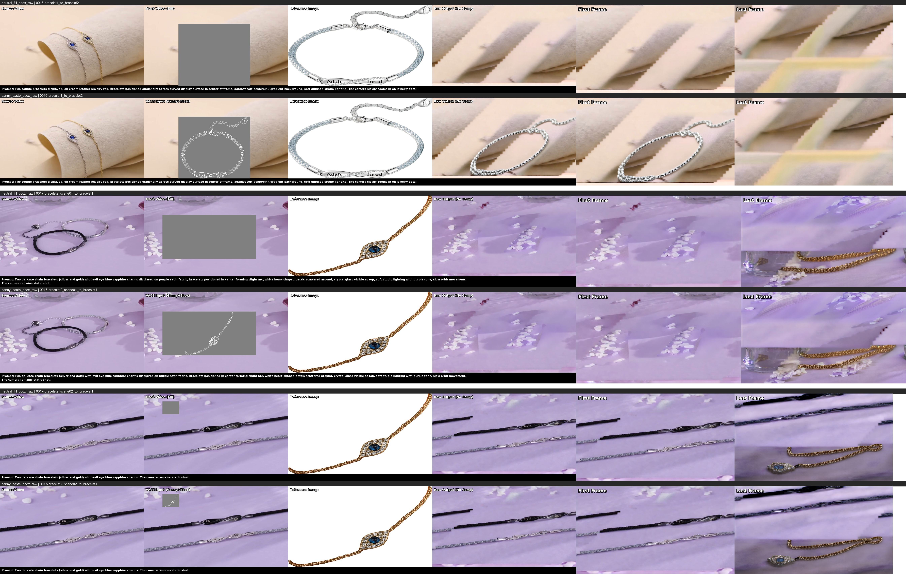
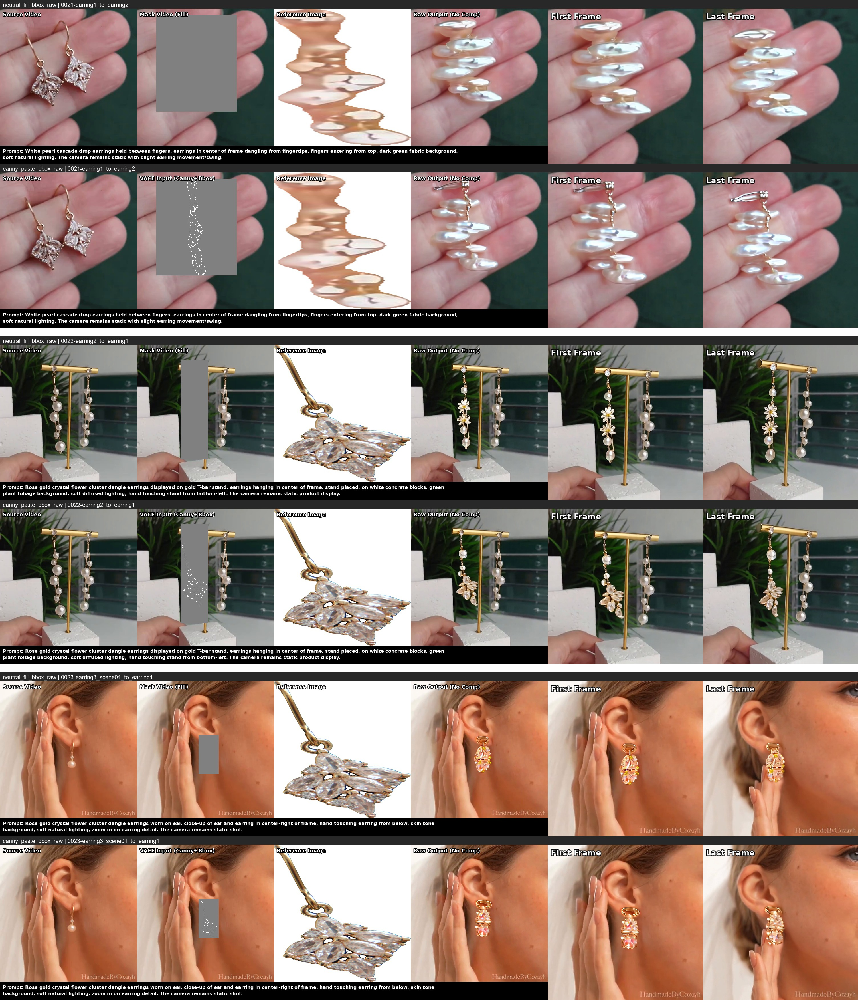
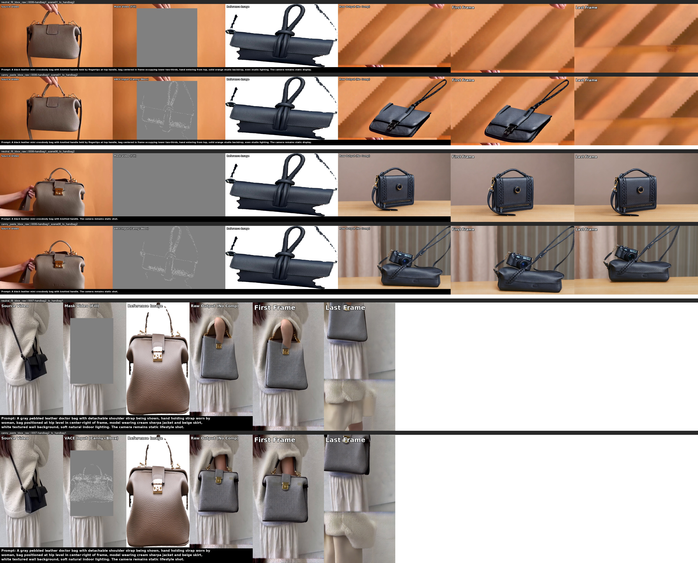
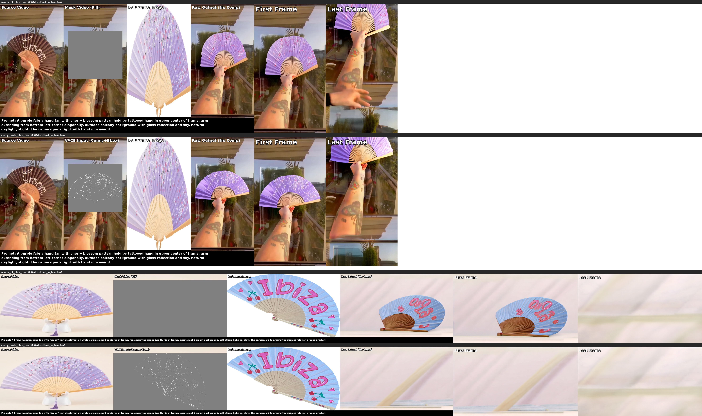
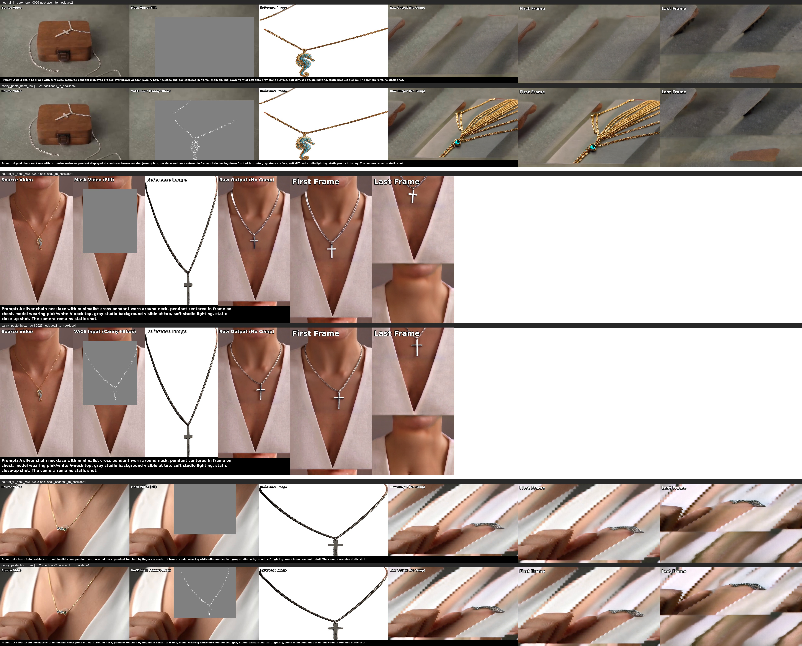
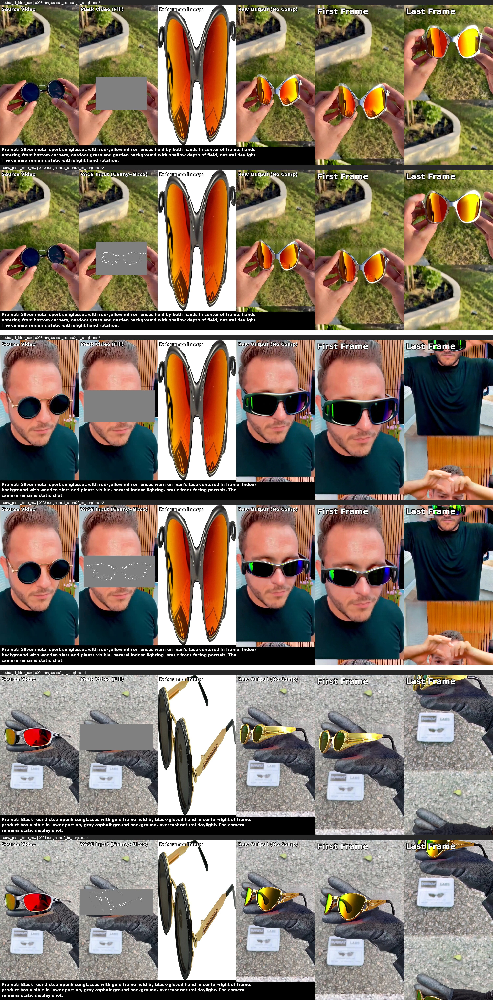
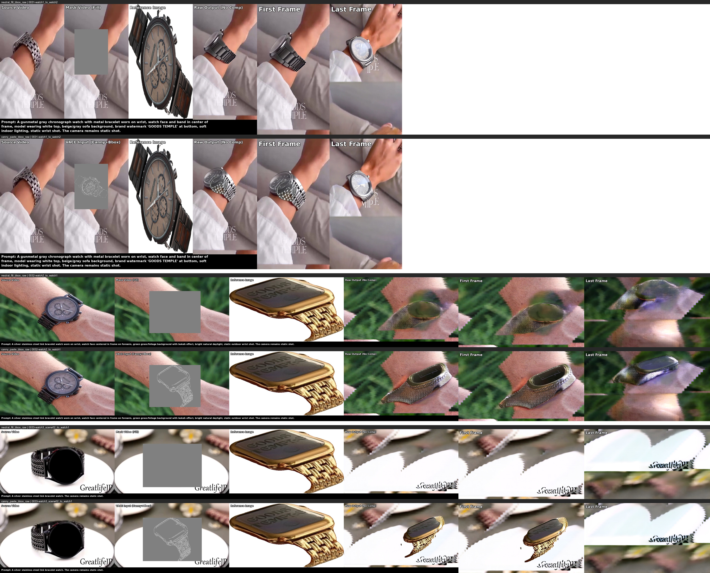

# PVTT 目标替换实验报告：VACE 原始输出分析

## 1. 实验概述

本次实验旨在验证使用 Wan2.1-VACE 模型直接进行 PVTT（Product Video Template Transformation）目标替换的效果，**不经过 `composite_with_mask` 后处理合成**，直接输出模型生成的原始视频，以排除合成步骤对视觉质量的影响。

### 实验配置

| 配置项 | 值 |
|--------|------|
| 模型 | Wan2.1-VACE 1.3B |
| 生成帧数 | 81 |
| FPS | 16 |
| 推理步数 | 50 |
| CFG Scale | 7.5 |
| Seed | 42 |
| Bbox Margin | lr=20, top=20, bottom=20 |
| 采样任务数 | 23（8 种产品类别，每类 2~3 个任务） |

### 两个实验对比

| 实验 | 输入 | 输出目录 |
|------|------|----------|
| **neutral_fill_bbox_raw** | mask video（中性色 128 填充）+ bbox mask + ref img + prompt | `results/1.3B/pvtt_neutral_fill_bbox_raw/20260314_110652` |
| **canny_paste_bbox_raw** | mask video（中性色填充 + 首帧 mask 区域嵌入 ref img 的白色 Canny 边缘图）+ bbox mask + ref img + prompt | `results/1.3B/pvtt_canny_paste_bbox_raw/20260314_002824` |

两者的核心区别：canny_paste 在首帧的 mask 区域额外嵌入了参考产品图的 Canny 边缘线条，为模型提供首帧的空间结构引导。

---

## 2. 实验结果

### 2.1 Bracelet（手链）



| 任务 ID | 结果分类 | 说明 |
|---------|----------|------|
| 0016-bracelet1_to_bracelet2 | 杂乱噪声 | 画面不断闪烁 |
| 0017-bracelet2_scene01_to_bracelet1 | 杂乱噪声 | 画面不断闪烁 |
| 0017-bracelet2_scene02_to_bracelet1 | 杂乱噪声 | 仅 34 帧 mask（58% 为冻结填充），画面闪烁严重 |

### 2.2 Earring（耳环）



| 任务 ID | 结果分类 | 说明 |
|---------|----------|------|
| 0021-earring1_to_earring2 | **正常** | 画面稳定，主体可辨 |
| 0022-earring2_to_earring1 | **正常** | 画面稳定，主体可辨 |
| 0023-earring3_scene01_to_earring1 | **正常** | 画面稳定，主体可辨 |

### 2.3 Handbag（手提包）



| 任务 ID | 结果分类 | 说明 |
|---------|----------|------|
| 0006-handbag1_scene01_to_handbag2 | 杂乱噪声 | 画面闪烁 |
| 0006-handbag1_scene06_to_handbag2 | 画面滚动 | mask 覆盖整个画面（100% bbox），几乎等于全图重新生成 |
| 0007-handbag2_to_handbag1 | 画面滚动 | bbox 垂直位移极大（y_std=59px） |

### 2.4 Handfan（扇子）



| 任务 ID | 结果分类 | 说明 |
|---------|----------|------|
| 0001-handfan1_to_handfan2 | 画面滚动 | 扇子占画面比例大，bbox 垂直移动显著 |
| 0002-handfan2_to_handfan1 | 杂乱噪声 | 扇子占画面 68%（avg bbox），画面闪烁 |

### 2.5 Necklace（项链）



| 任务 ID | 结果分类 | 说明 |
|---------|----------|------|
| 0026-necklace1_to_necklace2 | 杂乱噪声 | mask 覆盖率波动大（bbox 最高 67%），画面闪烁 |
| 0027-necklace2_to_necklace1 | 画面滚动 | bbox 区域大且位置变化 |
| 0028-necklace3_scene01_to_necklace1 | 杂乱噪声 | 画面闪烁 |

### 2.6 Purse（钱包）


| 任务 ID | 结果分类 | 说明 |
|---------|----------|------|
| 0012-purse1_to_purse2 | 画面滚动 | bbox 垂直移动（y_std=20.85px） |
| 0013-purse2_to_purse1 | 杂乱噪声 | bbox 垂直位移大（y_std=29.5px），画面闪烁 |
| 0014-purse3_scene01_to_purse1 | 杂乱噪声 | 仅 33 帧 mask（59% 冻结填充），画面闪烁严重 |

### 2.7 Sunglasses（太阳镜）



| 任务 ID | 结果分类 | 说明 |
|---------|----------|------|
| 0003-sunglasses1_scene01_to_sunglasses2 | 画面滚动 | bbox 垂直位移（y_std=24.25px） |
| 0003-sunglasses1_scene02_to_sunglasses2 | 画面滚动 | bbox 垂直位移（y_std=16.26px） |
| 0004-sunglasses2_to_sunglasses1 | 画面滚动 | bbox 轻微移动 |

### 2.8 Watch（手表）



| 任务 ID | 结果分类 | 说明 |
|---------|----------|------|
| 0031-watch1_to_watch2 | 画面滚动 | bbox 垂直位移极大（y_std=108.86px，跨越 390px，占画面高度 47%） |
| 0032-watch2_to_watch1 | 杂乱噪声 | 画面闪烁 |
| 0033-watch3_scene02_to_watch1 | 杂乱噪声 | 画面闪烁 |

---

## 3. 结果统计

### 3.1 总体质量分布

| 结果分类 | 任务数 | 占比 | 代表案例 |
|----------|--------|------|----------|
| 画面正常 | 3 | 13.0% | earring 系列 |
| 画面滚动 | 9 | 39.1% | sunglasses、watch1、handbag 等 |
| 杂乱噪声/闪烁 | 11 | 47.8% | bracelet、handfan2、necklace 等 |

### 3.2 各类结果的 Mask 统计特征

| 特征 | 正常（n=3） | 杂乱噪声（n=11） | 画面滚动（n=9） |
|------|-------------|-------------------|-----------------|
| 平均精确 mask 覆盖率 | 3.72% | 12.12% | 17.05% |
| 平均 bbox 覆盖率 | 18.17% | 37.33% | 37.33% |
| bbox Y 中心标准差 | 10.21px | 10.49px | 29.76px |
| 视频分辨率 | 480×480 | 多为 856×480 | 多为 480×856 |

### 3.3 Canny 首帧嵌入的效果

- 首帧嵌入 Canny 边缘图**在画面正常的任务中能提升首帧的主体一致性**（对比对比图的第四列可以看出 canny 版本的首帧产品形态更接近参考图）
- 但对于杂乱噪声和画面滚动的任务，**Canny 嵌入几乎不起作用**——底层时序一致性问题掩盖了首帧引导的效果
- 总体而言，主体一致性保持能力一般，即使在正常任务中也远未达到精确替换的要求

---

## 4. 问题原因分析

### 4.1 杂乱噪声/闪烁的原因

经过对代码、掩码数据和任务配置的深入分析，杂乱噪声/闪烁的根本原因是**多因素叠加**：

#### 原因 1：Mask 帧数不足导致的时序不连续（关键因素）

部分视频的 mask 帧数远少于模型要求的 81 帧。代码中 `load_masks_from_dir` 通过**复制最后一帧 mask** 来填充不足的帧数：

```python
# load_masks_from_dir 中的填充逻辑
if len(mask_files) < num_frames:
    while len(mask_files) < num_frames:
        mask_files.append(mask_files[-1])  # 复制最后一帧
```

受影响的任务：

| 任务 | 实际 mask 帧数 | 填充帧数 | 填充比例 |
|------|---------------|---------|---------|
| 0014-purse3_scene01 | 33 | 48 | **59.3%** |
| 0017-bracelet2_scene02 | 34 | 47 | **58.0%** |
| 0006-handbag1_scene06 | 51 | 30 | **37.0%** |

当物体在真实帧中有持续运动（如手链从右向左移动），突然冻结在最后位置不动（填充帧），VACE 的时序注意力机制无法理解这种**"运动→突然静止"**的不连续信号，产生噪声和闪烁。

#### 原因 2：Bbox 覆盖率过大

当被替换物体占画面比例很大时，bbox mask 覆盖了大部分画面区域：

| 任务 | Avg Bbox 覆盖率 | Max Bbox 覆盖率 |
|------|-----------------|-----------------|
| 0006-handbag1_scene06 | 100.00% | 100.00% |
| 0002-handfan2 | 68.86% | 90.00% |
| 0026-necklace1 | 50.34% | 67.10% |

当 bbox 覆盖超过 50%，大部分画面被中性灰色(128)填充，模型几乎看不到原视频的内容，等同于"从灰色背景生成全新视频"，而非"在原视频基础上做局部替换"。这远超 VACE 的局部编辑能力范围。

#### 原因 3：Bbox 帧间剧烈变化

部分任务的 bbox 位置/大小在帧间变化剧烈（物体快速运动、形变），导致模型输入的掩码区域不稳定，时序注意力难以建立一致的生成。

### 4.2 画面滚动的原因

#### 原因：Bbox 的大幅垂直位移

当物体在视频中有大幅度的垂直运动（人走动、镜头上下摇摆），bbox 的 Y 中心位置逐帧移动：

| 任务 | Y 中心标准差 | Y 行程 | 占画面高度 |
|------|-------------|--------|-----------|
| 0031-watch1 | 108.86px | ~390px | **47%** |
| 0007-handbag2 | 59.41px | 大 | 大 |
| 0001-handfan1 | 26.00px | 中 | 中 |

bbox 代表的中性色填充区域（灰色矩形）在画面中持续上移或下移，VACE 将这种系统性移动的灰色区域解读为**画面滚动/镜头平移**信号，在生成内容中重现了这种"翻页滚动"效果。

竖屏视频（480×856）比横屏视频更容易出现此问题，因为垂直方向的像素空间更大，同样的物体运动在垂直方向上占比更高。

### 4.3 为什么 Earring 系列表现正常

Earring 系列是唯一三个实验均正常的产品类别，分析其共性：

| 特征 | Earring 系列 |
|------|-------------|
| 分辨率 | 480×480（正方形） |
| mask 帧数 | 161~325（远超 81，无填充问题） |
| 精确 mask 覆盖率 | 0.55%~7.72%（物体小） |
| bbox 覆盖率 | 4.00%~36.40%（适中） |
| bbox 运动幅度 | Y_std=3.93~16.19px（轻微摆动） |

三个关键条件同时满足：**mask 帧数充足** + **物体小、bbox 覆盖率适中** + **物体运动平缓连续**。

---

## 5. PVTT 目标替换的局限性分析

从实验结果中可以总结出，使用 VACE 直接做 PVTT 目标替换存在以下根本性局限：

### 5.1 大面积 Mask 导致模型失去原视频上下文

当被替换目标占据画面绝大部分位置时，bbox mask 覆盖了几乎整个画面，模型在 mask 区域内只看到灰色填充，完全失去了原视频的信息。

**典型案例：`easy_0002-handfan2_to_handfan1`**
- 扇子占画面比例极大，avg bbox 覆盖率 68.86%，最大达 90%
- 模型几乎需要从零生成整个画面，而非做"局部替换"
- 结果：生成杂乱噪声

### 5.2 物体与其他元素的纠缠

当被替换目标与模特/道具/背景紧密交织时，生成的 mask 不可避免地会将周围元素一起掩盖。

**典型案例：`easy_0026-necklace1_to_necklace2`**
- 项链贴着模特颈部/胸部，mask 同时覆盖了颈部皮肤和衣服
- 模型看不到被掩盖的身体部位，无法保持它们不变
- bbox 覆盖率高达 50.34%（avg），67.10%（max）

### 5.3 替换不合理导致的违和感

某些目标替换本身在语义上就不合理——不同类型的产品需要不同的使用姿势/场景。

**典型案例：`easy_0007-handbag2_to_handbag1`**
- 原视频：模特**背着斜挎包**，身体姿势适配斜挎
- 替换目标：**手提包**，正常使用需要手提/挎在臂弯
- 强行保持模特原有姿势（背着的动作）不变而将包替换为手提包，在视觉和语义上都极不自然
- 这类替换需要同时修改模特的姿势，已超出简单目标替换的能力范围

---

## 6. 结论

### 6.1 核心发现

1. **VACE 1.3B 直接做 PVTT 目标替换的成功率很低**：23 个采样任务中仅 3 个（13%）产生正常画面
2. **主体一致性保持能力一般**：即使在正常任务中，生成的产品外观也与参考图有较大差异；首帧嵌入 Canny 图可轻微提升一致性，但效果有限
3. **两大主要失败模式**：
   - 杂乱噪声/闪烁（47.8%）：主要由 mask 帧数不足、bbox 覆盖率过大、bbox 帧间剧变导致
   - 画面滚动（39.1%）：主要由 bbox 大幅垂直位移导致
4. **PVTT 任务本身的局限性**（与模型无关）：部分替换场景在语义上不合理、大面积 mask 导致缺失原视频上下文、物体与环境纠缠

