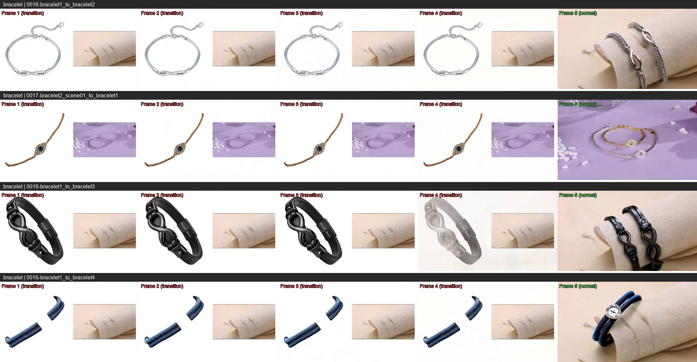
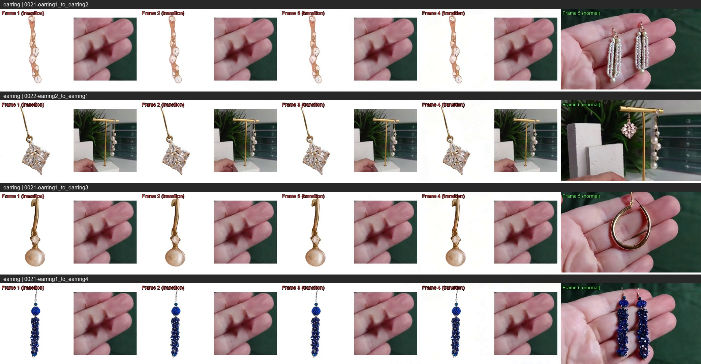
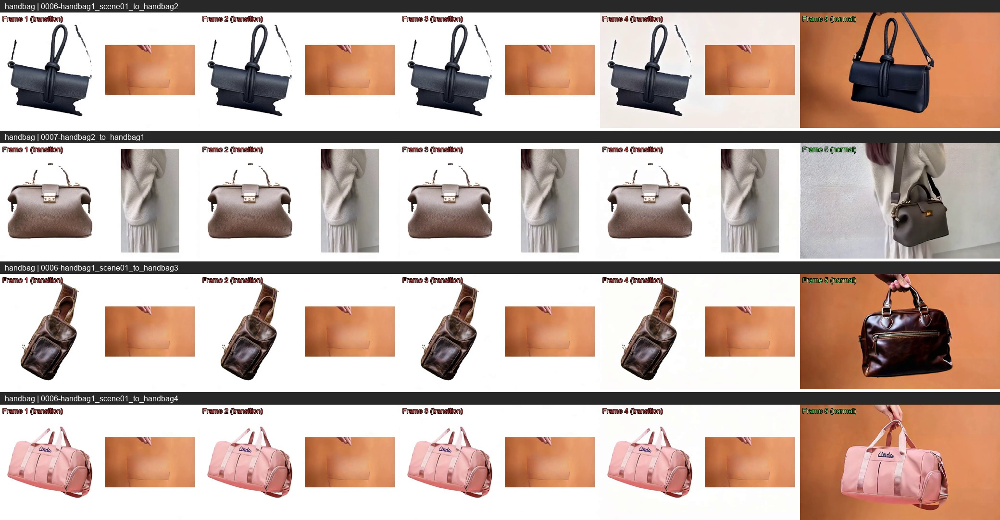
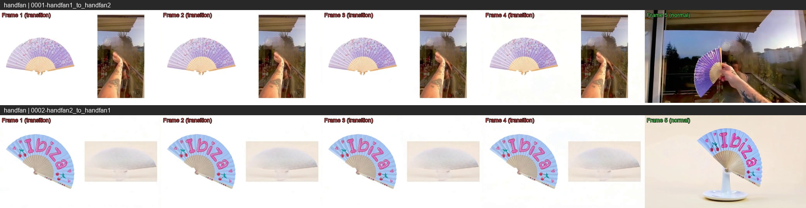
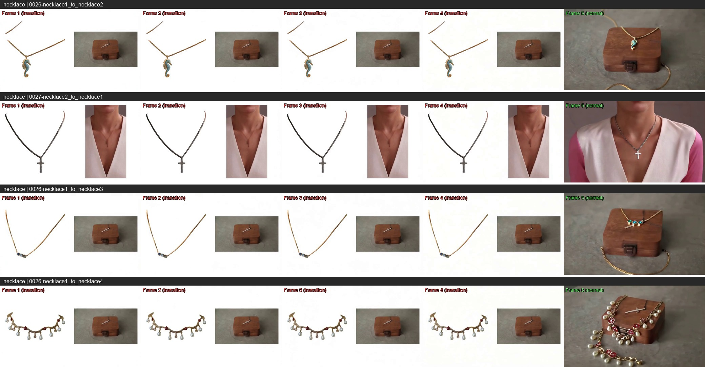
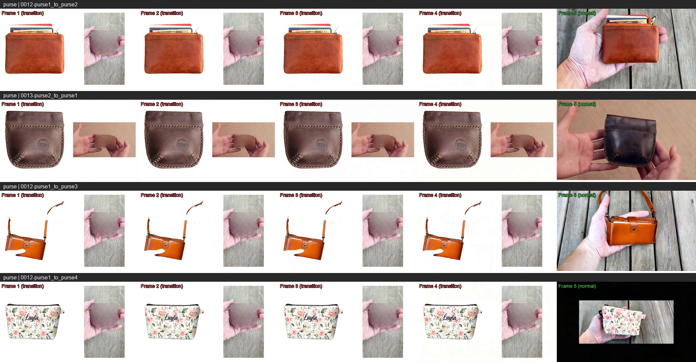
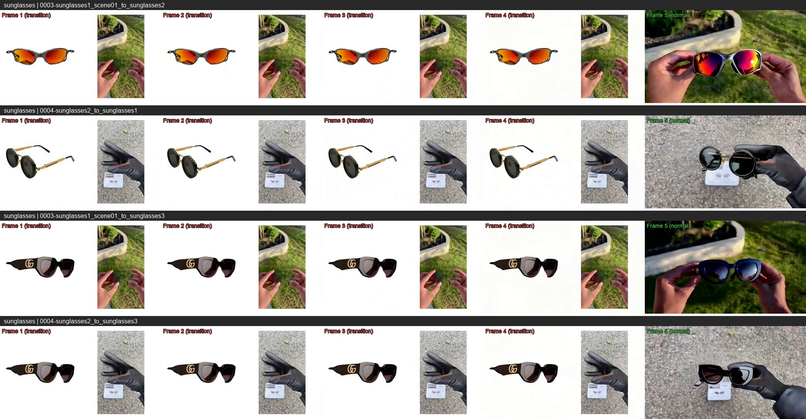
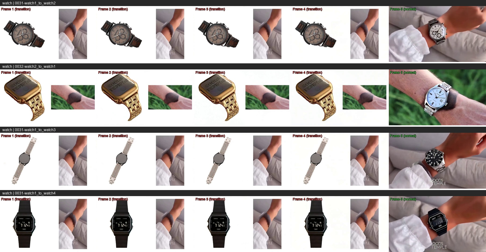

# FFGo 原版模型转场帧可视化

## 说明

根据 FFGo 论文，模型生成的视频前 4 帧为转场帧（从拼贴首帧过渡到自然画面），第 5 帧开始为正常画面。本文档展示每个实验样例的第 1~5 帧，用于观察转场质量。

- **Frame 1~4**（红色标注）：转场帧
- **Frame 5**（绿色标注）：转场完成后的首帧（正常画面）

实验结果目录：
- 第一批：`experiments/results/ffgo_original/pvtt/20260317_165346`
- 第二批：`experiments/results/ffgo_original/pvtt/20260317_185832`

---

## Bracelet（手链）

---

## Earring（耳环）

---

## Handbag（手提包）

---

## Handfan（扇子）

---

## Necklace（项链）

---

## Purse（钱包）

---

## Sunglasses（太阳镜）

---

## Watch（手表）

